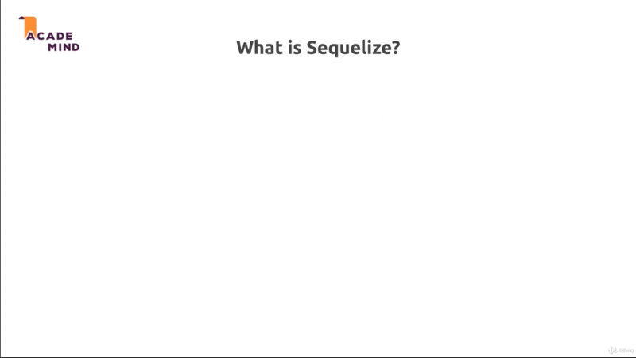
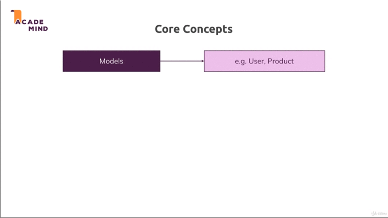
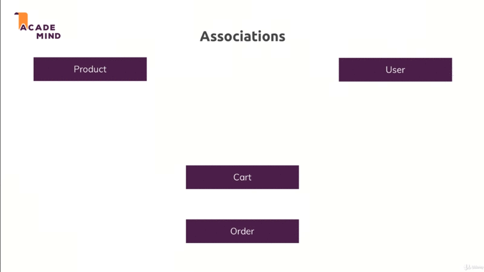

# Understanding Sequelize

## Table of Contents
1. [Module Introduction](#module-introduction)
2. [What is Sequelize](#what-is-sequelize)
3. [Association](#association)

<br/>

## Module Introduction

In the last module (chapter), you learned how to use `SQL` in NodeJS application
and we did this example of a `MariaDB` database which we want to use to store
data.

Now we didn't complete the [project-5](../project-5) with that `SQL` approach
simply because in this chapter, we'll implement other features like for example
working with the `shopping cart` with the help of `sequelize`. This will still
use the same `MariaDB` database actually behind the scenes or in the background
as a database but the code we write instead of `SQL` statement as in
[cart.js](../project-5/models/cart.js) file

```javascript
    save() {

        return db.execute(
            "INSERT INTO product (title, price, imageUrl, description) VALUES (?, ?, ?, ?)",
            [this.title, this.price, this.imageUrl, this.description]
        );
    };

    static deleteById(id) {
    };

    static fetchAll() {

        return db.execute("SELECT * FROM product");
    };

    static findById(id) {

        return db.execute("SELECT * FROM product WHERE product.id = ?", [id]);
    };
```

We'll use a third party package  that allow us to work with JavaScript `object`
and convenient methods to create new elements in the database, to `edit`,
`delete`, or to `find` them and also connect them, because you remember, a `SQL`
database typically also work with `relations` and we got lot of `relations` in
our current project.

You will learn what exactly `sequelize` this third package is; and how  you can
use it and we'll then implement our `product` and our `cart` and so on in this
chapter with `sequelize`.

**[⬆ back to top](#table-of-contents)**
<br/>
<br/>

## What is Sequelize
<br/>



To be precise `sequelize` is `Object Relational Mapping Library`, which simply
means it does **all the heavy lifting**, all the `SQL` code behind the scenes
for us and `maps` it into JavaScript `objects` with convenience methods which we
can call to execute that behind the scenes `SQL` code so that we never have to
write `SQL` code on our own.

We got our `object` let's say a `User` with `name`, `age`, `email`, and
`password` but of course this can be anything, could be a `product`, whatever
you need and this is `mapped` to a database `table` by `sequelize`; so it
automatically creates that `table` for use even, ti automatically sets up
`relations` and `tables` even for us; And when we create a `new` `user` for
example, we simply call a method on that `User` JavaScript `object` and
`sequelize` executes the `SQL` query or the `SQL` command that is required.

So instead or writing this on our own, we simply create a JavaScript `object`
and work with that and here would be one example using `sequelize` to create
a `new User` which would behind the scenes execute the `SQL` code we don't have
to write.

```javascript
const user = User.create({
    name: "Max",
    age: 28,
    password: "1234abcd",
    email: "max@academind.com"
});
```

### Sequelize core concept
<br/>



`sequelize` offers us the `models` to work with our database; as I showed you on
the last slide and it allows us to define such `models`.

So basically define which data makes up a `model` and therefore which data will
be saved in the database.

We can then instantiate these `models`, so these classes so to say, we can
execute the `constructor` functions or use utility ([lib](./../project-5/lib/))
methods to create; let's say a new `User` object based on that `model`.


So we have a connection here and we can then run `queries` on that. That could
be that we save a new `User` but it could also be that we find all user
(`User.findAll()`) as an example and here again, this always relates back to our
`model` which we define with `sequelize`; and we can also for example
`associate` our `User` model to a `Product`model.

In the end we don't want to learn that in theory, we want to see that in
practice. So let's add `sequelize` to our [project](./../project-6); and let's
slowly integrate it to manage our `Product` in our `Cart`and so on through
`sequelize`.

**[⬆ back to top](#table-of-contents)**
<br/>
<br/>

## Association
<br/>


<br />

What do you mean by association ? You could say `relation`. In this above
diagram we have 4 table: `Product`, `User`, `Cart`, `Order`. Now if we want to
connect all tales and define how tables work together, then a `Product` probably
belong to `many` `Cart`, because our `User` will have carts therefore we have
multiple users, `multiple` carts; and therefore a `Product` can belong to `many`
carts because different users can add the same `Product` to their `Cart`

Each `User` has only one `Cart`. A `Product` can also be part of `multiple`
`Order` and a `User` can have `multiple` orders, because typically user order
more than one product.

A `User` can also own `multiple` `Product`, in a sense of this `User`
**created** this `Product`, in the sense of `User` offer this product, `User`
sell some products on the shop.

Above a rough outline of how we can communicate or relate different models,
these is what we can also reflect in [sequelize](https://sequelize.org).

**[⬆ back to top](#table-of-contents)**
<br/>
<br/>
