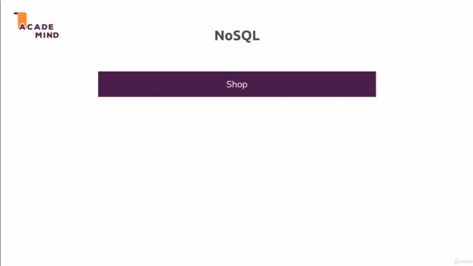
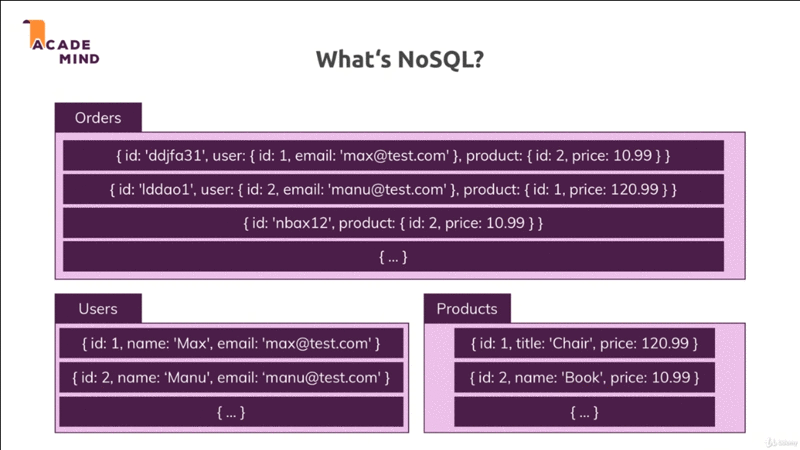
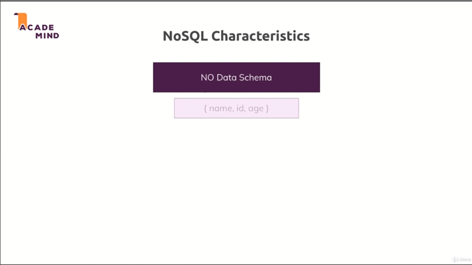

# Working with NoSQL Using MongoDB

## Table of Contents
1. [Module Introduction](#module-introduction)
2. [What is MongoDB](#what-is-mongodb)
3. [Relation in NoSQL](#relation-in-nosql)
4. [Module Summary](#module-summary)

<br/>

## Module Introduction
<br/>


In this module we have look more in MongoDB, what it is and how you can start up
, you can use MongoDB to be database inside your NodeJS code.

**[⬆ back to top](#table-of-contents)**
<br/>
<br/>

## What is MongoDB


MongoDB is both the name of the company which develop MongoDB to be but also
then of their most famous product a _database solution_ of database engine. You
could say a tool you can use to run very efficient NoSQL.

The name stems from the word *humongous* because MongoDB was built for one major
purpose that you could store and work wilt lots and lost of data. MongoDB to be
is build for large scale applications, MongoDB to be as built to quickly clear
,store and interact with data.

MongoDB it's really fast and it's really awesome database philosophy behind
those SQL databases and they'll for all the behind MongoDB.

### How MongoDB works

Just like in the SQL world we spin up the database server and then we can
have multiple databases.
<br/>



For example a **Shop** database, in the SQL world we would have multiple
**tables**, in NoSQL MongoDB world we have multiple **collection** like `Users`
and `orders` collected for example.

Inside of each **collection** we don't have so-called **record** but we have
a couple **documents**. **documents** also look different then **records** did,
It's not just about different names being used. The core philosophy behind
that database really is totally different one. MongoDB is **schema-less**,
inside of one **collection** your **documents** is **do not have to have the
same structure**, and this totally different in SQL world.

In SQL we had a **User** table and in that table we had an **Id**, **name**,
**email** and **password**. In NoSQL world we can have any kind of data in one
and the same **collection**. Often in NoSQL world you will still end up with at
least similar structure but you're not forced to have exactly the same
structure; and this gives you more **flexibility** also for your application to
**grow** and to **change** it's data requirements over time. Without being
difficult to depict (describe) in your database world.

A document in MongoDB look like:

```nosql
{
    "name": "max",
    "age": 29,
    "address":
        {
            "city": "Munich"

        },
    "hobbies": [
        { "name": "Cooking" },
        { "name": "Sports" }
    ]
}
```

This looks a lot like JavaScript object notation; and to be precise it kind of
is. MongoDB to be uses JSON to store data in **collections** (tables), every
**document** you store looks something like above. It follows the JavaScript
object notation (JSON) format. To be very precise moment to be used a something
which is called **BSON** (Binary JSON) but that only means that MongoDB to be
kind of transforms this behind scenes before storing it in the files.

In the MongoDB document structure you can have **nested** (embedded) documents.
For example the `address` wold hold and embed to **document**, and you can also
have an **array** inside of the **document**, the array data can hold other
**document** of the objects or ti could also just hold **string, numbers**
anything of that kinds

So again for the data you have a great flexibility and the existence of these
nested **documents** also means **relation** are managed a bit differently in
the NoSQL MongoDB world.

**[⬆ back to top](#table-of-contents)**
<br/>
<br/>

## Relation in NoSQL

So we know how we store data. And in NoSQL world is gives developer more
flexibility also regarding the storage of relations between different data.



In NoSQL world it would be pretty normal to have some **documents** like above.
Here are 3 **collections** and we have some _duplicate_ data in there.

```nosql
Orders: [
    {id:'ddjfa31'.user:{id: 1, email:'max@test.com'}.product:{id:2, price: 10.99}}
]
Users: [
    {id: 1, name: 'Max', email: 'max@test.com'}
]
```

We have `Users` **collection** which holds all details about a user but then we
might have some copy of that data in an embedded (nested) **document** in
another **document** in other **collection**.

So instead just **matching** by **Id** in SQL world, here you can also depict
(describe) a **relation** by embedding data into **documents**. You could embed
the **Id** which points out an error **document**; So do you still have to merge
two **documents** manually and you will indeed have to do that pretty manually,
but you can also just take the information that is important for you in the
context of a numbered **document**; let say here is some **User** data for the
**Orders** and you copy that into the **orders** an then you have the data right
there whenever you fetch all **orders** without you having to fetch all
**orders** then look for fitting **Users** and fetched them to you. This is part
of what makes NoSQL and especially MongoDB to be so fast and efficient.

It really is built to make sure that you **query** your data in the form that
you need that you store the in the form that you needed that you don't have to
do a lot of **merging** and so on but that you can really fetch data in the form
that you need it without having to **combine** multiple **collections** behind
the scenes on the server.


<br/>

**Nested and embed**  are one alternative for depicting (describing) relations.
**References** are another one.

Above the embedded example, where the `address` are part of our **customer
document**; instead having two **collection** (customer and addresses) and then
matching by **Id** here we put the address right into the **customers
documents**

There are also cases where you would have a lot  of data duplication and where
you need to work with that data a lot and hence it would change a lot and you
would have to manually **update** it in all duplicate places where are you using
**embedded documents** is not **ideal**.

For Example if you have some `favBooks` for every **customers**, well you would
have lots of data duplication because a lot of **customers** might have the same
favorite book and these books might's and change a lot, maybe there is a new
edition published and you would have to go to all **customers documents** who
have these books as favorite and update the entries for each **customers
documents** in such scenario it would be easier to still go to **collection**
and only store the **references** to the **Books** and a **Customers**
documents, and then manually merged with the books which are managed in
a different **collection**.

By the time you will get a **feeling** for which approach you want to follow
(use). The idea using **references** we can embed or we can references whatever
fits the purpose, and with that we know how MongoDB generally works.




The important thing in MongoDB is **not having a schema** hence we have more
flexibility **no structurer required**, and we have **fewer data relations**
because we can relate by **embedding**.

We can still build relations manually with **references** as you saw but you
should always know if that is the best approach right now. Or if you can use an
**embed document** with too much work.

These are NoSQL characteristic and there are among would be correct or mistakes,
and these are all part of the reason why MongoDB to be is so popular because of
the **speed** and **flexibility** it gives you.


**[⬆ back to top](#table-of-contents)**
<br/>
<br/>

## Module Summary
<br/>


**[⬆ back to top](#table-of-contents)**
<br/>
<br/>
