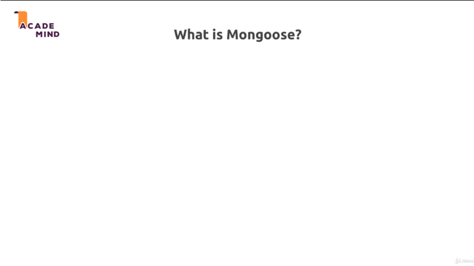
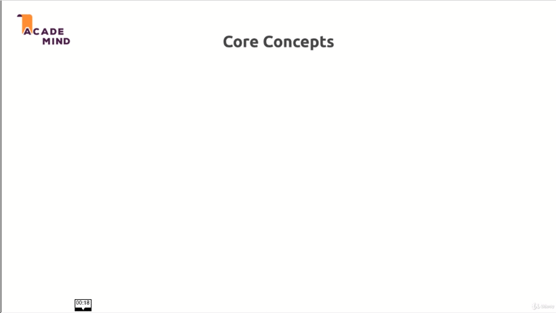

# Working with Mongoose

## Table of Contents
1. [Module Introduction](#module-introduction)
2. [What is Mongoose](#what-is-mongoose)
3. [Schema in Mongoose](#schema-in-mongoose)

<br/>

## Module Introduction
<br/>


In MongDB we can abstract some complexity away from us and focus more on our
data than the queries we write. In SQL we had `sequelize` for ORM, indeed in
NoSQL databases especially in MongoDB we have `mongoose`. Mongoose is pretty
similar to sequelize in terms o what it tries to do, it tries to enable you to
work with the data instead of queries.

**[⬆ back to top](#table-of-contents)**
<br/>
<br/>


## What is Mongoose
<br/>



Is ODM (Object Document Mapping) for NoSQL database. Mongoose provides
a straight-forward, schema-based solution to model your application data. It
includes built-in type casting, validation, query building, business logic hooks
and more, out of the box.  [mongoose](http://mongoosejs.com)

Mongoose is really similar to Sequelize which was an ORM, and the difference of
course just is that MongoDB is not a relational database, it's document
database, it thinks in document.

So the idea stays the same though, we have some data, some entity in our
application. Let say `User` and we want to save that to a collection (table), we
want to `map` our JavaScript object to a document in a collection that could
look in above diagram, and of course we can write the query for that on our own,

```javascript
db.collection("user")
    .insertOne(
        {
            name     : "Max",
            age      : "28",
            password : "dsg312"
        }
    )
```

Above code is exactly what we did in last module, but it would be a bit easier
if we could just focus on our **objects** and **data**,

```javascript
const user = User.create({
    name     : "Max",
    age      : "28",
    password : "dsg312"
});
```

See how it should look like and then work with it, this is not even final syntax
you see here, we can use `mongoose` a bit differently then you see it here but
even that would be a bit more concise (shorter).

So just as Sequelize, `mongoose` tries to allow us to define models with which
we then work and where all the queries are done behind the scenes which of
course does not mean that we can't influence and that we can't change some
things.

### Mongoose Core Concepts
<br/>



The core concepts are that we work with `schemas` and `models` where we define
how our data should look like, and then we have so-called `instances` where
instantiate our models; So where we create real JavaScript objects we can work
with that are based on our blueprints, and once we get that setup, we can run
queries and there we again use our objects, we use our models but through
`mongoose` with various helpers we get, some syntactical sugar and so on.o

That's the idea behind `mongoose`, really similar to what Sequelize did for SQL.
Let's dive into [project-8](./../project-8)

### What is ORM

Object-relational mapping (ORM, O/RM, and O/R mapping tool) in computer science
is a programming technique for converting data between incompatible type systems
using object-oriented programming languages.  This creates, in effect,
a "virtual object database" that can be used from within the programming
language.There are both free and commercial packages available that perform
object [wiki](http://en.wikipedia.org/wiki/Object-relational_mapping)


**[⬆ back to top](#table-of-contents)**
<br/>
<br/>

## Schema in Mongoose

 MongoDB is schemaless, so why we now start to create a schemas? Well the idea
 is simply, whilst we have the flexibility or not being restricted to a specific
 schema, we often will have a certain structure in the data we work with and
 therefore `mongoose` wants to give you the advantage of focusing on just your
 data.

For that it needs to know how your data looks like and therefore we define such
a schema for the structure our data will have. But important, we can still
deviate (differ) by assigning a `title` with type `string` and more strict with
`required` as like an object.

```javascript
const mongoose = require("mongoose");

const Schema = mongoose.Schema;

const productScehma = new Schema({
    title: {
        type: String,
        required: true          // Use restricted schema
    },
    price: {
        type: Number,
        required: true
    },
    imageUrl: {
        type: String,
        required: true
    },
    description: {
        type: String,
        required: true
    }
});
```

So having a schema makes sense even though we have the flexibility to deviate.
It depends on your application whether you need all that flexibility or whether
you want to have some structure and you want to have some tool. It just
deliberate decision to give some flexibility but gain other advantage


**[⬆ back to top](#table-of-contents)**
<br/>
<br/>
