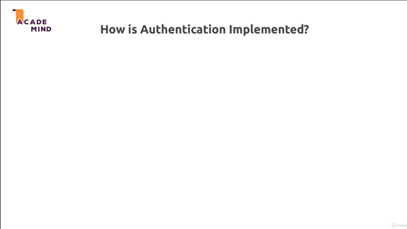
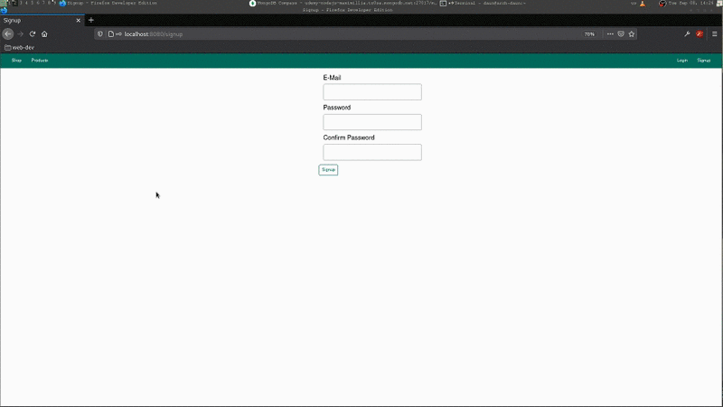

# User Authentication

## Table of Contents
1. [Module Introduction](#module-introduction)
2. [What is Authentication](#what-is-authentication)
3. [How is Authentication Implemented](#how-is-authentication-implemented)
5. [Implementing an Authentication](#implementing-an-authentication)

 

## Module Introduction
 

We have learned what Session and Cookies are and we had our dummy authentication
flow in place, let's dive into real authentication. This mean that in this
chapter (module), we'll add a functionality that allows Users to `sign up`,
`sign in` and we'll make sure that some resources can really only be accessed by
User who are signed in, and that we're not just hiding the menu options but that
we really lock down access. We will also store `password` securely

So in this module we'll have a look at what exactly **authentication is**, **how
it works** in NodeJS application or in web application in general because this
actually this is not limited to NodeJS, authentication would be implemented in
backend languages in the same way.

We'll have a look at how we can **store and use the credential**, so the email
and the password with which the User signed up and we will dive into **protecting
routes** to make sure Users are only able to access the routes they need to
access and that we don't just hide the menu options but that we really check the
**permissions** on the server side.

**[⬆ back to top](#table-of-contents)**
 
 

## What is Authentication
 

 

Well w obviously got our **User** using our application, interacting with our
views and we get the **server** and **database** with which our server works,
these are all things we worked in this course already.

Now in our application, we might have different _routes_, _actions_ a User can
do. We might be able to **view all products**, to **create and manage product**,
or to **place orders**, obviously we can do more things in our application but
these are just some examples.

The idea behind authentication is that not all these actions are available to
every User of our application, here's one important thing, with User I don't
mean logged in User, I mean simply a person visiting our page, visiting
**localhost://3000**, later of course the domain which we deploy it.

So I'm not talking about logged in User but really just people using our page
and such anonymous Users who are not logged in should not be able to do all
3 actions. Anonymous User should be able to view all products, just as you are
able to view all product an Amazon.com even if you're not logged in, we want to
allow this in our shop too.

There are other things like for example here **creating, managing products** and
**placing orders** which only available to logged in Users and not to every
visitor of our page, because in order to **buy a product**, you need to be logged in
and in order to **create new product**, you also need to logged in, because in
our application, we of course connect a product to the logged in User, we match
the two things.

This what we need authentication for. We need to be able differentiate between
anonymous Users who are not logged in and logged in Users; and we need to
provide a flow, a view and the backend logic that allows people visiting our
page, to _sign up_ and then to _sign in_ and then we can _use Sessions_ as last
module  to _store the information_ whether a user is signed in and well let him
interact with the page across request.

**[⬆ back to top](#table-of-contents)**
 
 

## How is Authentication Implemented
 

 

We have same setup, we get a **user**, our backend, the **server** side code and
**database**; now typically, a User will send a **login request**. A User or
visitor needs to have signed up before but after you signed up User or visitor
can login with email and password; and the server, we check whether that email
and password combination is valid; whether we have a user with that email and
password in our database.

If that the case, we create a **session** for this user, and the session
identifies only for specific user. This is required because otherwise without
a session, even if we find out that the credential are valid, for the very next
request the user would be logged out again because remember, **request interact
separated from each other**; they don't know anything about each other, we need
session to connect them, this is why we create one with the user or the
authentication information.

We then return 200 response, a success response and we obviously also **store the
cookie** belonging that session on the client (frontend), we return that with
that response so that we really established a session.

Thereafter the user is able to visit our **restricted routes**, because now this
cookie is sent with every request, on the server we can connect this cookie to
a session and in the session we have the information whether that user is signed
in or not; and if user is signed in, we can grant access to certain resources.

This is how authentication is implemented in any web application that render
views, we'll learn a different way of adding authentication later when we work
with a **REST and GraphQL API's**; but for traditional web app as we are
building it here where we do render EJS or handlebars or whatever templating
engine you use, where we render such views, there will use this session based
authentication approach.

**[⬆ back to top](#table-of-contents)**
 
 

## Implementing an Authentication
 

 

**[⬆ back to top](#table-of-contents)**
 
 
