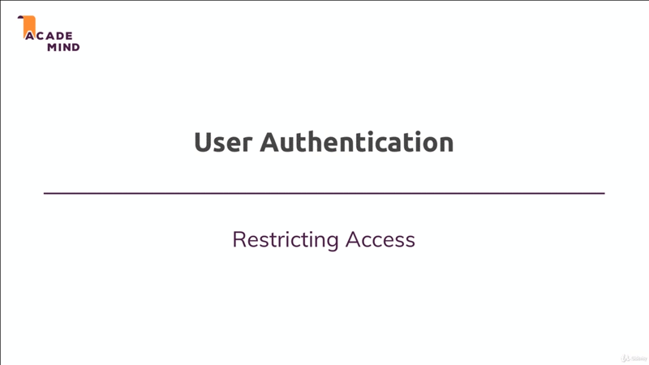
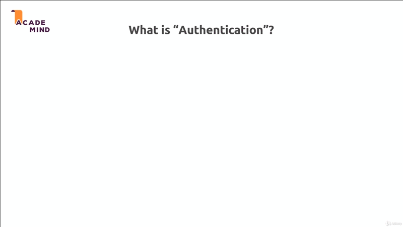

# User Authentication

## Table of Contents
1. [Module Introduction](#module-introduction)
2. [What is Authentication](#what-is-authentication)

 

## Module Introduction
 

We have learned what Session and Cookies are and we had our dummy authentication
flow in place, let's dive into real authentication. This mean that in this
chapter (module), we'll add a functionality that allows Users to `sign up`,
`sign in` and we'll make sure that some resources can really only be accessed by
User who are signed in, and that we're not just hiding the menu options but that
we really lock down access. We will also store `password` securely

So in this module we'll have a look at what exactly **authentication is**, **how
it works** in NodeJS application or in web application in general because this
actually this is not limited to NodeJS, authentication would be implemented in
backend languages in the same way.

We'll have a look at how we can **store and use the credential**, so the email
and the password with which the User signed up and we will dive into **protecting
routes** to make sure Users are only able to access the routes they need to
access and that we don't just hide the menu options but that we really check the
**permissions** on the server side.

**[⬆ back to top](#table-of-contents)**
 
 

## What is Authentication
 

 

Well w obviously got our **User** using our application, interacting with our
views and we get the **server** and **database** with which our server works,
these are all things we worked in this course already.

Now in our application, we might have different _routes_, _actions_ a User can
do. We might be able to **view all products**, to **create and manage product**,
or to **place orders**, obviously we can do more things in our application but
these are just some examples.

The idea behind authentication is that not all these actions are available to
every User of our application, here's one important thing, with User I don't
mean logged in User, I mean simply a person visiting our page, visiting
**localhost://3000**, later of course the domain which we deploy it.

So I'm not talking about logged in User but really just people using our page
and such anonymous Users who are not logged in should not be able to do all
3 actions. Anonymous User should be able to view all products, just as you are
able to view all product an Amazon.com even if you're not logged in, we want to
allow this in our shop too.

There are other things like for example here **creating, managing products** and
**placing orders** which only available to logged in Users and not to every
visitor of our page, because in order to **buy a product**, you need to be logged in
and in order to **create new product**, you also need to logged in, because in
our application, we of course connect a product to the logged in User, we match
the two things.

This what we need authentication for. We need to be able differentiate between
anonymous Users who are not logged in and logged in Users; and we need to
provide a flow, a view and the backend logic that allows people visiting our
page, to _sign up_ and then to _sign in_ and then we can _use Sessions_ as last
module  to _store the information_ whether a user is signed in and well let him
interact with the page across request.

**[⬆ back to top](#table-of-contents)**
 
 
