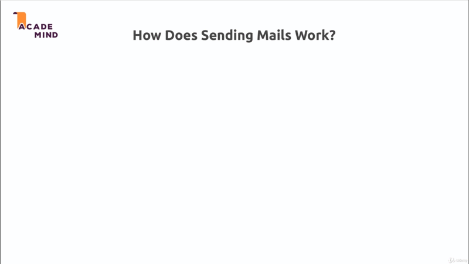

# Sending Email

## Table of Contents
1. [Module Introduction](#module-introduction)
2. [How Does Sending Mails Work](#how-does-sending-mails-work)

 

## Module Introduction

In this chapter (module), I now want to give you an introduction to how you can
send emails from inside of your NodeJS application. Obviously sending emails is
a crucial task in many web application and in our website here, we could want to
send an email after a user signed up for example to confirm the sign up, some
thing like that.

Now for that I will show you that works, what a sending emails in a NodeJS
application actually means and which part NodeJS and ExpressJS play in that big
picture and we'll then implement it.

We'll then implement a package that helps us sending emails and we'll send an
email upon successful sign up.

**[⬆ back to top](#table-of-contents)**
 
 

## How Does Sending Mails Work
 

 

Well we obviously get our NodeJS server with our code and we get our User and we
want to send email. Now it's super important to understand and a common
misconception that NodeJS and ExpressJS, these are language or framework
runtimes that we use for writing our server side logic but with NodeJS, you
**can't** trivial create **mailing server (mail server)**.

Handling mails is totally different to handling incoming request and response,
it's totally different technology, something totally different happens behind
the scenes. Therefore in reality, you will very likely never implement your own
mail server because that is a very complex task.

Creating a mail server that is capable of handling thousand or one hundred
thousand of emails at the same time, sending them and so on; security, all that
stuff is highly complex.

So in reality you typically use **third party** mail server; for that and that
is exactly what we will do in this module too; but I will show you how to
interact with such a service to send that email through that service; And by the
way all major web application you might be interacting with including Udemy
don't have their own mail server, they are using third party providers like AWS
or whatever it is for sending emails. So that is exactly what we will do in this
module too.

It doesn't rule out possibility you will create your own mail server, lots of
resources especially in Linux environment gives a super power mail server that
run on your VPN as your application in production.

**[⬆ back to top](#table-of-contents)**
 
 

