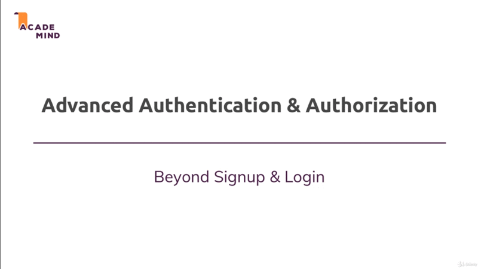
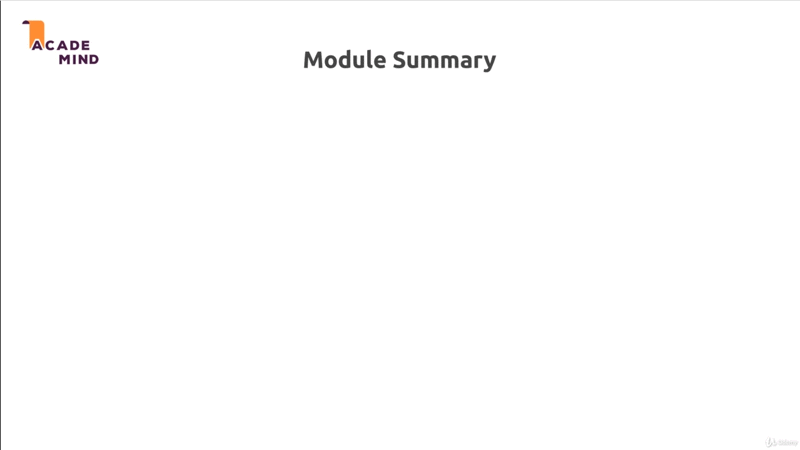

# Advanced Authentication

## Table of Contents
1. [Module introduction](#module-Introduction)
2. [Module Summary](#module-summary)

 

## Module Introduction
 

 

We have learned some new tricks regarding how we can send mails, let's use that
new knowledge to improve authentication features and in general, let's improve
our security or the authentication related things in our app. For example let's
also work on ensuring that only users who created a post can edit it; but let's
start with resetting password.

To be precise in this module (chapter) we'll start with **resetting password**
but then we'll have a look at **authorization** which is part I just talked
about with ensuring that you can only **edit**, **delete** what you **created**.

**[⬆ back to top](#table-of-contents)**
 
 

## Module Summary
 

 

**[⬆ back to top](#table-of-contents)**
 
 
