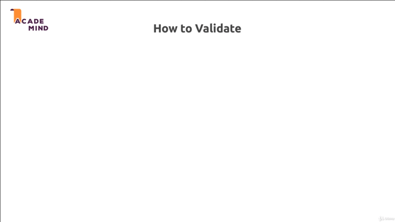

# Understanding Validation

## Table of Contents
1. [Module Introduction](#module-introduction)
2. [Why validate](#why-validate)
3. [how To Validate](#how-to-validate)

 

## Module Introduction
 

Now what we learned how to add users to our application, let's take step
backward and let's have a look at an important topic that is related to any
visitor, no matter if he or she is authenticated or not, interacting with your
website.

I'm talking about handling _user input_ and most importantly, that will be the
topic of this module, _validating that user input_.

We'll have a look at why validation is important, so what do I mean with
validating user input and why would we want to do that?

These are the **_core_** things and I will show you how you can ensure that the
data you work with is _really the data_ and in the _format you expect to get
it_.

So, let's see what exactly validation is and why we would want to add it.

**[⬆ back to top](#table-of-contents)**
 
 

## Why validate
 

 

So why would we want to add some data or input validation to our application?
Well if we have a user interacting with our website, then we typically have
a lot of forms on any web application we build. In our example project for
example, we have a form for _signing up_, we got one for _signing in_, and we
got one for _adding products_ and the bigger your application is, the more data
you will need from your users at some point of time.

So we have that form with which our _user_, our _visitor_ of the website
interacts with. Now in the end when this form is submitted with a _post request_
as we controlled it in our form, then a _request_ is sent to our backend and by
the way you could also configure it to send a _get request_ but the key thing
_here is a request with the form data is sent_ and we're already doing this in
this course because this is a crucial task in any web application.

Now on our backend (NodeJS) code, we then typically interact with a database or
maybe we write the data into a normal file but in the end we take the data which
we receive and we want to store it. This is exactly the part which can be
_dangerous_ or _problematic though_.

Right now in the app we got no kind of data validation. If a user in our current
application would try to _login_ with something that is _not a valid email
address_, we would allow that, we're not preventing the user from entering
something incorrect.

The same is true for adding a product, we don't care about what the user enters
and this is what I want to change this module. We'll add some validation as an
extra step right at the start of our NodeJS code _when we handled a request on
the server_, definitely before we store it in a database; And this is validation
can then either succeed and allow the data to be _written_ to the _database_ or
to _a file_ or allow it to be **_handled_** by the rest of our NodeJS code or we
**_reject_** the input and then basically return some information to the user
prompting the user to correct the error.

This is what we will work on in this module and I will show you how to validate
and how to provide a good user experience.

**[⬆ back to top](#table-of-contents)**
 
 

## How To Validate
 

 

How do you validate user input? Well obviously we got our _user entering some
data into a from_, we got our _server where we want to handle_ that. Now we got
a couple places where we can add validation.

For example we can validate on `[1]` **_client side_** with the help of
JavaScript. So before any request is sent, we can write some JavaScript that for
example watches the inputs for key events; So for the user typing and then
checks the input whilst the user is working on the form and then you can display
an error because you can use JavaScript to change the DOM at runtime.  You can
display an error right in the browser before anything is sent to the server.

Now this is can greatly enhance your _user experience_ and it is something which
I discuss in my dedicated JavaScript and JavaScript framework courses and
_client side_ validation is **_totally optional_**. That is important. It can be
definitely improve the user experience and therefore you might want to consider
using it but it is optional because since we client side JavaScript, so
_JavaScript code that runs in the browser, the user can see that code_, the user
_could change that code_ and the user can of course _disable JavaScript_.

So _client side_ validation is not a protection that secure you against
incorrect data being sent to your server, **_this is not secure solution_**,
it's only there to improve the user experience because of course there you can
validate and you can show a nice error message and keep the old input so that
user doesn't have to re-enter that email address where the `@` sign was
forgotten but again it's only for user experience thing. It's not really secure.

So your next option to validate is `[2]` **_server side_**. Now this is what
we'll focus on in this module and in this course because this is of course what
we do with NodeJS.  We have to do that because this code can't be seen or
changed by the user; The user _can't disable_ us using that code because it
happens on the server (your NodeJS web server engine), not in the browser. This
is the _crucial part_ where we have to add validation, where we really _have to
filter out invalid values_. This is a must have, it's absolutely required and it
is what we'll focus on; And this then ensure that we only work with valid data
in our node app and ultimately if we do plan on storing it, that we do store
correct data.

Now also important, for some database engines and for most database engines
actually, like for example MongoDB there is also a `[3]` **_built in
validation_**. Which you can turn on. I do cover example on my MongoDB course.
_It's also optional_ because this can be a last resort (recourse) but if you
have good server side validation in place as you should have, then this might
not be required because there is not really a scenario where invalid data could
reach your database because you filter it out in that server side validation
already.

No matter which approach you have if you validate on the server side and or in
the database (not really an option), in the end this can of course fail and then
**_you should always return an error message_**, a helpful error message if
possible and **_never reload the page_** but always keep the data the user
already inserted because that of course is a horrible user experience which we
all know that you enter something incorrect and you get back 'hey, this password
is not know or this email address is unknown', and you have to enter it all
again. So this is another part on which I'll focus in this module that we
provide a good user experience.

With that theory we know how to do a validation. Time to turn that theory into
practice.

**[⬆ back to top](#table-of-contents)**
 
 

