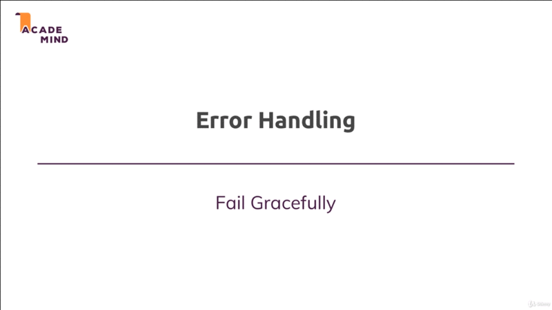

# Error Handling

## Table of Contents
1. [Module Introduction](#module-introduction)
2. [Types of Errors](#types-of-errors)
3. [Analyzing the Error handling](#analyzing-the-error-handling)

<br/>

## Module Introduction
<br/>


<br/>

In this module let's have a look at something you can't avoid, it's an error.
There will be errors in the application in the web pages you create and some
errors can of course avoid it by testing your code properly. But some errors are
due to happen.

You will always have some bug issues in your code and even if you don't, your
database server might be off-line, users do send an invalid data. So there will
be errors, and in this module we'll have take a look at _different type of an
errors_, _how to handle these different types of errors_ in an elegant way in
your NodeJS Express application.

**[⬆ back to top](#table-of-contents)**
<br/>
<br/>

## Types of Errors

### How Bad Are errors
<br/>


<br/>

Errors are not necessarily the end of your app. You can recover from the errors.
You can inform the user that something went wrong and that he should try again,
for example. You just need to handle an errors correctly. That the take away
key, and there are different type of errors.

### Different Types of Errors
<br/>


<br/>

#### Technical | Networks Errors

Where you have very little influence on at least if you're not the system
administrator.

For technical errors, our hosts are MongoDB server might might be down and they
offer any interaction with the database will fail. In such a case, there's not
that much we can do,

The best thing might be to _show you some error page to the user_ to let the
user know that something is wrong. On our end that we are sorry and that we're
working on fixing the issue.  We also might want to, behind the scenes send an
email to the administrator or anything like that.

#### Expected Errors

There are certain operations, let's say we are interacting with a _file_ or with
a _database_ that can fail. Not very often; And of course it's not really expect
that for this to foal but that can happen. Maybe because there are too many
simultaneous request to a certain file, anything like that.

Here we informing the user and giving the user the ability to retry. Might be
a good solution. For example, the validation errors which we also implement in
early module, these would all be expected errors. Users will input valid and
invalid data; And for invalid data we want to inform the user, and give the user
a chance of retrying.

#### Bug | Logical Errors

Of course, we also have errors in our code, where we interact with a user object
in a place where it just can't exist or at least not in all circumstances.

We should fix such errors during development. We should test our code and we
should fix such issues of course. These are not errors we should handle at
runtime. We should not show a message to the user because these errors are not
the user or the networks faults they are our fault.

### Working with Errors
<br/>


<br/>

#### Error is Thrown

How can we work with the different types of errors? We have to differentiate.
There are areas where the **_errors is thrown an error_** or is a technical
object in a node application. So there is a built in error object which we can
throw. That's also a JavaScript language features. Basically all programming
languages have such a features.

We also have scenarios where we can't continue with our code but there is no
technical error. Now for the _error is thrown_ part we have certain tools we
can use to test code and catch potential errors, so we can handle errors
gracefully.

##### Synchronous Errors.

For **_Synchronous_** code we would be try to handle it with **_try & catch
blocks_**.

##### Asynchronous Errors.

For **_Asynchronous_** code we use **_then & catch blocks_** which you already
saw quite a lot from this course.

##### Synchronous & Asynchronous Errors.

In the end in both scenarios we the choice, `1` **_directly handle the errors_**
or we use _mechanism builtin into express_ a special `2` **_error handling
middleware_** which we haven't used thus so far, which we can use to _catch errors
and then return the response_ to the user and I'll show how this works in this
module of course.

#### No Errors is Thrown

An example, would be that we try to log a user in but the email address doesn't
exist; This is not really a technical error. There's no error being thrown, but
we know we can continue; And so we want to check for this scenario as well and
handle it appropriately.

##### Validate Values

Well, we just have to check values with `if` check, for example; And then we can
decide what we want to:

##### Thrown an Error

We enter the _Error is thrown world_, and then kick off that error handling
process.

##### Direct Handle the Error

We can directly handle the error which is not a technical error; But we we're
simply add some code that can continuing our code with missing the inputted
data, for example.

#### Return the errors

In all cases we've got different ways of communicating with our users. We can
`1` **_return an error page (500)_**; So dedicated page that informs the user
'hey we have a problem' and that of course we should be kind of last resort,
because the end user loses all his input can continue.

We also can `2` return the page which we know which user was on and just give
some **_error information_** (intended page/response). That's what we did for
validating for example, there we returned the page to use was on, and kept the
input values and just added an error message.

Or we could `3` **_redirect_**; for example, we try to access a page which we
are not authenticated to visit then we can redirect the user.

So these are different tools. We have different ways of working with errors we
have. Now let's dive into our code and see what we're already using and what we
can use.

**[⬆ back to top](#table-of-contents)**
<br/>
<br/>

## Analyzing the Error handling

So in our application we get a bunch of error handling in place already. Let
start in `app.js`

```javascript
app.use((request, response, next) => {

    if (!request.session.user)  {
        return next();
    };

    User.findById(request.user._id)
        .then(user => {

            request.user = user;
            next()
        })
        .catch(err => console.log(err));
});
```

There I do already handle the case or I do have a _catch block_ at least where
I try to fetch my _user_ . I do have a _catch block_ at least where I try to
fetch my _user_ `User.findById(request.user._id)`, and fetch the user from the
session; And then store the user object `request.user = user`.  We will improve
that in the second.

In my `controller/auth.js` I also have some error handling,

```javascript
...
...
const postLogin = (request, response , next) => {

    User.findOne({ email: email })
        .then(user => {                                         // @NOTE: Error check

            if (!user) {
                return response
                    .status(442)
                    .render("auth/login", {
                        pageTitle: "Login",
                        path: "/login",
                        errorMessage: "Invalid email address",
                        oldInput: {
                            email: email,
                            password: password
                        },
                        validationErrors: [
                            // @NOTE: Ensure what exactly error and assign 'invalid' class
                            {
                                param: "email"
                            }
                        ]
                    });
            };

            bcrypt.compare(password, user.password)
                .then(doMatch => {

                    if (!doMatch) {
                        return response
                            .status(442)
                            .render("auth/login", {
                                pageTitle: "Login",
                                path: "/login",
                                errorMessage: "Invalid password",
                                oldInput: {
                                    email: email,
                                    password: password
                                },
                                validationErrors: [
                                    // @NOTE: Ensure what exactly error and assign 'invalid' class
                                    {
                                        param: "password"
                                    }
                                ]
                            });

                    };

                    request.session.isLoggedIn = true;
                    request.session.user = user;
                    request.session.save(err => {

                        if(!err) {
                            return response
                                .status(303)
                                .redirect("/");
                        };

                        console.log("===> session error:", err);
                    });
                })
                .catch(err => {

                    console.log("===> bcrypt error:", err);
                    return response
                        .status(301)
                        .redirect("/login");
                });
        })
        .catch(err => console.log(err));                        // @NOTE: Catch the error
}
...
...
```

I do check in `postLogin` whether his email address does exist; And if not, I do
already return the same page with an error code actually, where I do pass that
information, _that the input was invalid_ `errorMessage: 'invalid email
address'`.

We do the same with the validation logic in `routes/auth.js` when we used the
`express-validator` package to add built in validation.

```javascript
...
...

router.post("/login",
    [
        body("email")
            .isEmail()
            .withMessage("Please enter a valid email address")
            .normalizeEmail(),
        body("password", "Password not valid")
            .isLength({ min:5 })
            .isAlphanumeric()
            .trim()
    ],
    authController.postLogin);
...
...
```

There behind the scenes the `express-validator` also _froze_ and _handles
errors_ and allows us to simply collect all these errors which are now is _not
technical error object_; But which are simply we're  just data managed by that
package.

We collect the error in `controllers/auth.js` with,

```javascript
const error = validationResult(request);
```

And then handle them manually,

```javascript
if (!errors.isEmpty) {
...
...
}
```

And we _handle them manually_ or we added the `if` check where we check if data
we got is enough (fulfillment) to continue or not. We get _no technical error_
being frozen here. These _technical error_ can always be seen if you have an
error message on terminal.

We have no such error but we still have invalid code and therefore we checked
this manually `if (!errors.isEmpty())`  and proceed on our own.

In our custom validator `routes/auth` however if we have a look at that there
I do _throw_ a _technical error_. for example when password do not match.

```javascript

...
...
body("confirmPassword")
    .trim()
    .custom((value, {request}) => {

    if (value !== reqeust.body.password) {
        throw new Error ("Password not match, Please enter the matched password");
    };

    return true;
})
...
...
```

Now this error would normally bubble up and would be handled by ExpressJS but
this `express-validator` or package happens to also handle it.

This error handling which I want to dive into first before we then start
implementing proper solution for the different kinds of errors we could have.


**[⬆ back to top](#table-of-contents)**
<br/>
<br/>
