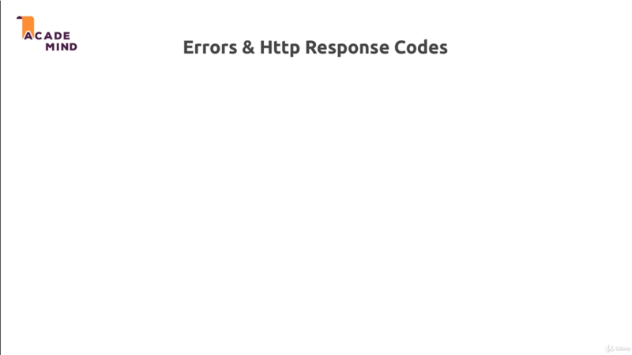

# Error Handling

## Table of Contents
1. [Module Introduction](#module-introduction)
2. [Types of Errors](#types-of-errors)
3. [Analyzing the Error handling](#analyzing-the-error-handling)
4. [Some Error Theory](#some-error-theory)
5. [Error and HTTP Response Codes](#error-and-http-response-codes)
6. [Module Summary](#module-summary)

<br/>

## Module Introduction
<br/>


<br/>

In this module let's have a look at something you can't avoid, it's an error.
There will be errors in the application in the web pages you create and some
errors can of course avoid it by testing your code properly. But some errors are
due to happen.

You will always have some bug issues in your code and even if you don't, your
database server might be off-line, users do send an invalid data. So there will
be errors, and in this module we'll have take a look at _different type of an
errors_, _how to handle these different types of errors_ in an elegant way in
your NodeJS Express application.

**[⬆ back to top](#table-of-contents)**
<br/>
<br/>

## Types of Errors

### How Bad Are errors
<br/>


<br/>

Errors are not necessarily the end of your app. You can recover from the errors.
You can inform the user that something went wrong and that he should try again,
for example. You just need to handle an errors correctly. That the take away
key, and there are different type of errors.

### Different Types of Errors
<br/>


<br/>

#### Technical | Networks Errors

Where you have very little influence on at least if you're not the system
administrator.

For technical errors, our hosts are MongoDB server might might be down and they
offer any interaction with the database will fail. In such a case, there's not
that much we can do,

The best thing might be to _show you some error page to the user_ to let the
user know that something is wrong. On our end that we are sorry and that we're
working on fixing the issue.  We also might want to, behind the scenes send an
email to the administrator or anything like that.

#### Expected Errors

There are certain operations, let's say we are interacting with a _file_ or with
a _database_ that can fail. Not very often; And of course it's not really expect
that for this to foal but that can happen. Maybe because there are too many
simultaneous request to a certain file, anything like that.

Here we informing the user and giving the user the ability to retry. Might be
a good solution. For example, the validation errors which we also implement in
early module, these would all be expected errors. Users will input valid and
invalid data; And for invalid data we want to inform the user, and give the user
a chance of retrying.

#### Bug | Logical Errors

Of course, we also have errors in our code, where we interact with a user object
in a place where it just can't exist or at least not in all circumstances.

We should fix such errors during development. We should test our code and we
should fix such issues of course. These are not errors we should handle at
runtime. We should not show a message to the user because these errors are not
the user or the networks faults they are our fault.

### Working with Errors
<br/>


<br/>

#### Error is Thrown

How can we work with the different types of errors? We have to differentiate.
There are areas where the **_errors is thrown an error_** or is a technical
object in a node application. So there is a built in error object which we can
throw. That's also a JavaScript language features. Basically all programming
languages have such a features.

We also have scenarios where we can't continue with our code but there is no
technical error. Now for the _error is thrown_ part we have certain tools we
can use to test code and catch potential errors, so we can handle errors
gracefully.

##### Synchronous Errors.

For **_Synchronous_** code we would be try to handle it with **_try & catch
blocks_**.

##### Asynchronous Errors.

For **_Asynchronous_** code we use **_then & catch blocks_** which you already
saw quite a lot from this course.

##### Synchronous & Asynchronous Errors.

In the end in both scenarios we the choice, `1` **_directly handle the errors_**
or we use _mechanism builtin into express_ a special `2` **_error handling
middleware_** which we haven't used thus so far, which we can use to _catch errors
and then return the response_ to the user and I'll show how this works in this
module of course.

#### No Errors is Thrown

An example, would be that we try to log a user in but the email address doesn't
exist; This is not really a technical error. There's no error being thrown, but
we know we can continue; And so we want to check for this scenario as well and
handle it appropriately.

##### Validate Values

Well, we just have to check values with `if` check, for example; And then we can
decide what we want to:

##### Thrown an Error

We enter the _Error is thrown world_, and then kick off that error handling
process.

##### Direct Handle the Error

We can directly handle the error which is not a technical error; But we we're
simply add some code that can continuing our code with missing the inputted
data, for example.

#### Return the errors

In all cases we've got different ways of communicating with our users. We can
`1` **_return an error page (500)_**; So dedicated page that informs the user
'hey we have a problem' and that of course we should be kind of last resort,
because the end user loses all his input can continue.

We also can `2` return the page which we know which user was on and just give
some **_error information_** (intended page/response). That's what we did for
validating for example, there we returned the page to use was on, and kept the
input values and just added an error message.

Or we could `3` **_redirect_**; for example, we try to access a page which we
are not authenticated to visit then we can redirect the user.

So these are different tools. We have different ways of working with errors we
have. Now let's dive into our code and see what we're already using and what we
can use.

**[⬆ back to top](#table-of-contents)**
<br/>
<br/>

## Analyzing the Error handling

So in our application we get a bunch of error handling in place already. Let
start in `app.js`

```javascript
app.use((request, response, next) => {

    if (!request.session.user)  {
        return next();
    };

    User.findById(request.user._id)
        .then(user => {

            request.user = user;
            next()
        })
        .catch(err => console.log(err));
});
```

There I do already handle the case or I do have a _catch block_ at least where
I try to fetch my _user_ . I do have a _catch block_ at least where I try to
fetch my _user_ `User.findById(request.user._id)`, and fetch the user from the
session; And then store the user object `request.user = user`.  We will improve
that in the second.

In my `controller/auth.js` I also have some error handling,

```javascript
...
...
const postLogin = (request, response , next) => {

    User.findOne({ email: email })
        .then(user => {                                         // @NOTE: Error check

            if (!user) {
                return response
                    .status(442)
                    .render("auth/login", {
                        pageTitle: "Login",
                        path: "/login",
                        errorMessage: "Invalid email address",
                        oldInput: {
                            email: email,
                            password: password
                        },
                        validationErrors: [
                            // @NOTE: Ensure what exactly error and assign 'invalid' class
                            {
                                param: "email"
                            }
                        ]
                    });
            };

            bcrypt.compare(password, user.password)
                .then(doMatch => {

                    if (!doMatch) {
                        return response
                            .status(442)
                            .render("auth/login", {
                                pageTitle: "Login",
                                path: "/login",
                                errorMessage: "Invalid password",
                                oldInput: {
                                    email: email,
                                    password: password
                                },
                                validationErrors: [
                                    // @NOTE: Ensure what exactly error and assign 'invalid' class
                                    {
                                        param: "password"
                                    }
                                ]
                            });

                    };

                    request.session.isLoggedIn = true;
                    request.session.user = user;
                    request.session.save(err => {

                        if(!err) {
                            return response
                                .status(303)
                                .redirect("/");
                        };

                        console.log("===> session error:", err);
                    });
                })
                .catch(err => {

                    console.log("===> bcrypt error:", err);
                    return response
                        .status(301)
                        .redirect("/login");
                });
        })
        .catch(err => console.log(err));                        // @NOTE: Catch the error
}
...
...
```

I do check in `postLogin` whether his email address does exist; And if not, I do
already return the same page with an error code actually, where I do pass that
information, _that the input was invalid_ `errorMessage: 'invalid email
address'`.

We do the same with the validation logic in `routes/auth.js` when we used the
`express-validator` package to add built in validation.

```javascript
...
...

router.post("/login",
    [
        body("email")
            .isEmail()
            .withMessage("Please enter a valid email address")
            .normalizeEmail(),
        body("password", "Password not valid")
            .isLength({ min:5 })
            .isAlphanumeric()
            .trim()
    ],
    authController.postLogin);
...
...
```

There behind the scenes the `express-validator` also _froze_ and _handles
errors_ and allows us to simply collect all these errors which are now is _not
technical error object_; But which are simply we're  just data managed by that
package.

We collect the error in `controllers/auth.js` with,

```javascript
const error = validationResult(request);
```

And then handle them manually,

```javascript
if (!errors.isEmpty) {
...
...
}
```

And we _handle them manually_ or we added the `if` check where we check if data
we got is enough (fulfillment) to continue or not. We get _no technical error_
being frozen here. These _technical error_ can always be seen if you have an
error message on terminal.

We have no such error but we still have invalid code and therefore we checked
this manually `if (!errors.isEmpty())`  and proceed on our own.

In our custom validator `routes/auth` however if we have a look at that there
I do _throw_ a _technical error_. for example when password do not match.

```javascript

...
...
body("confirmPassword")
    .trim()
    .custom((value, {request}) => {

    if (value !== reqeust.body.password) {
        throw new Error ("Password not match, Please enter the matched password");
    };

    return true;
})
...
...
```

Now this error would normally bubble up and would be handled by ExpressJS but
this `express-validator` or package happens to also handle it.

This error handling which I want to dive into first before we then start
implementing proper solution for the different kinds of errors we could have.

**[⬆ back to top](#table-of-contents)**
<br/>
<br/>

## Some Error Theory

### Synchronous Errors

Let's say I have temporary file named
[error-playground.js](./playground/error-playground.js); And inside of it
I create a function named `sum` function, be written like.

```javascript
const sum = (a, b) => {

    return a + b;
};

console.log (sum (1, 2));
```

We take two values `a` and `b`, and return it `a + b`; And then I call `sum (1,
2)` and console.log the result.

If we execute this with NodeJS,

```bash
$: node error-playground.js
3
```

We get the result is `3`.

But now let's add an error, let's say I only pass one argument instead of two;

```javascript
const sum = (a, b) => {

    return a + b;
};

console.log (sum (2));
```

Now if I execute this again I get not a number `NaN`, but not an error; Exactly,
not a _technical error object_.

```bash
$: node error-playground.js
NaN
```

Let's we ad `if` check statement,

```javascript
const sum = (a, b) => {

    if (a && b) {
        return a + b;
    }

    throw new Error("invalid arguments.");
};

console.log (sum (2));
```

If `a` and `b` or both are `true`, then I will return `a + b`; otherwise I'll
`throw` (throw is a build in keyword), a `new Error` (new Error is a build in
object with no chips); where is says `invalid arguments`.

Now if I execute this file again,

```bash
$: node error-playground.js

${HOME}/nodejs-maximillian-course/chapter-18-error-handling/playground/error-playground.js:7
    throw new Error("invalid arguments");
    ^

Error: invalid arguments
    at sum (${HOME}/nodejs-maximillian-course/chapter-18-error-handling/playground/error-playground.js:7:11)
    at Object.<anonymous> (${HOME}/nodejs-maximillian-course/chapter-18-error-handling/playground/error-playground.js:10:14)
    at Module._compile (internal/modules/cjs/loader.js:1201:30)
    at Object.Module._extensions..js (internal/modules/cjs/loader.js:1221:10)
    at Module.load (internal/modules/cjs/loader.js:1050:32)
    at Function.Module._load (internal/modules/cjs/loader.js:938:14)
    at Function.executeUserEntryPoint [as runMain] (internal/modules/run_main.js:71:12)
    at internal/main/run_main_module.js:17:47
```

Now we see such an error message, which we saw before in the course as well.
Here we _have our own error message_ `invalid arguments`; And then we got
a call stack which allows us to find out at which functions and which line
number this error was thrown and what was called before that error.

We saw that before because that is the _unhandled error_; we've `throw` an error
and that is built in functionality throwing such errors; And node with a lot of
the packages we use also throw errors behind the scenes. For example, MongoDB
will throw an error if it can't connect or if an operation fails.

So such errors can be thrown and if we don't handle them then our application
just crashes (stop immediately); And that's what we saw earlier in the course
too. You might remember a cases where I did something and we got stack and that
refreshed icon in the browser kept on spinning and nothing happened. _That was
because our server crashed because we had an error which we did not handle_.

Now how can we handle errors? Well one solution for _synchronous_ code that
executes line by line immediately and does not wait for anything. For example,
where we don't interact with files or where we don't send request; Well such
code can be wrapped with _try catch_ another build in language feature,

```javascript
const sum = (a, b) => {

    if (a && b) {
        return a + b;
    };

    throw new Error("invalid arguments");
};

try {

    console.log (sum (2));
}
catch (error) {
    console.log("===> Error occurred!")
    console.log("===>", error)
}
```

We use `try` block for certain code `console.log(sum(2))`; And then we have to
add `catch` block; Where we catch a potential error that might have been thrown.
With catch we can now handle the error. For example, we could output `error
occurred!` with also logging the error.

Now, if I re execute `error-playground.js`,

```bash
===> Error occurred!: Error: invalid arguments
===> Error: invalid arguments
    at sum (${HOME}/javascript/nodejs-maximillian-course/chapter-18-error-handling/playground/error-playground.js:7:11)
    at Object.<anonymous> (/home/daun/Project/javascript/nodejs-maximillian-course/chapter-18-error-handling/playground/error-playground.js:12:18)
    at Module._compile (internal/modules/cjs/loader.js:1201:30)
    at Object.Module._extensions..js (internal/modules/cjs/loader.js:1221:10)
    at Module.load (internal/modules/cjs/loader.js:1050:32)
    at Function.Module._load (internal/modules/cjs/loader.js:938:14)
    at Function.executeUserEntryPoint [as runMain] (internal/modules/run_main.js:71:12)
    at internal/main/run_main_module.js:17:47
```

I still get the errors, but I get this additional error message `===> Error
occurred!: Error: invalid arguments`; And I'm not log my error object here

```javascript
const sum = (a, b) => {

    if (a && b) {
        return a + b;
    };

    throw new Error("invalid arguments");
};

try {

    console.log (sum (2));
}
catch (error) {
    console.log("===> Error occurred!:")
    //console.log("===>", error)
}
```

I get the result,

```bash
$: node error-playground.js
===> Error occurred!
```

I actually get only logged `Error occurred`; So then My app ti odes not crash and
log it automatically; But we could do anything we want.

We could continue with adding a code,

```javascript
const sum = (a, b) => {

    if (a && b) {
        return a + b;
    };

    throw new Error("invalid arguments");
};

try {

    console.log (sum (2));
}
catch (error) {
    console.log("===> Error occurred!")
    // console.log("===>", error)
}

console.log("This is called after sum function")        // @NOTE: Adding another code
```

I run the code, we get the result,

```bash
$: node error-playground.js
===> Error occurred!
This is called after sum function
```

Just to demonstrate, as if I comment out `try catch` block, and I just try to
`console.log(sum(2))`

```javascript
const sum = (a, b) => {

    if (a && b) {
        return a + b;
    };

    throw new Error("invalid arguments");
};

// try {

//     console.log (sum (2));
// }
// catch (error) {
//     console.log("===> Error occurred!")
//     // console.log("===>", error)
// }

console.log(sum(4));
console.log("This is called after sum function")        // @NOTE: Adding another code
```

And I run the code above with the error been thrown,

```bash
node error-playground.js
${HOME}/javascript/nodejs-maximillian-course/chapter-18-error-handling/playground/error-playground.js:7
    throw new Error("invalid arguments");
    ^

Error: invalid arguments
    at sum ({HOME}/nodejs-maximillian-course/chapter-18-error-handling/playground/error-playground.js:7:11)
    at Object.<anonymous> (/home/daun/Project/javascript/nodejs-maximillian-course/chapter-18-error-handling/playground/error-playground.js:19:13)
    at Module._compile (internal/modules/cjs/loader.js:1201:30)
    at Object.Module._extensions..js (internal/modules/cjs/loader.js:1221:10)
    at Module.load (internal/modules/cjs/loader.js:1050:32)
    at Function.Module._load (internal/modules/cjs/loader.js:938:14)
    at Function.executeUserEntryPoint [as runMain] (internal/modules/run_main.js:71:12)
    at internal/main/run_main_module.js:17:47
```

Then we don't see this works anywhere, because it crashes with our error at it's
being thrown and it; And does not continue with other code. `console.log("This is called
after sum function")`

So this is why handling code like this is a good thing to do,

```javascript
 try {

     console.log (sum (2));
 }
 catch (error) {
     console.log("===> Error occurred!")
     // console.log("===>", error)
 }
```

Because this ensure that we can continue with code, and we can handle the error
gracefully in our NodeJS-Express application. We could send the error response
here which renders a valid page without crashing everything, but which inform
the user that something bad happened.

In the end this is what the `express-validator` package does for us with our
`thrown` error in `router/auth.js` where throwing the error. And
`express-validator` also `catch` the thrown error and then just adds it to its
own error array and allows us to read that list of error it caught.

That what happens behind the scenes you could say.

### Asynchronous Error

We also have async operation that can fail of course; And such operation when
using _promises_ are handled with `then-catch` block. That is what we can see
a lot in our code.

```javascript
User.findOne({ email: email })
    .then(user => {

        if (!user) {                                            // @NOTE: Custom check case
            return response
                .status(442)
                .render("auth/login", {
                    pageTitle: "Login",
                    path: "/login",
                    errorMessage: "Invalid email address",
                    oldInput: {
                        email: email,
                        password: password
                    },
                    validationErrors: [
                        // @NOTE: Ensure what exactly error and assign 'invalid' class
                        {
                            param: "email"
                        }
                    ]
                });
        }

        bcrypt.compare(password, user.password)
            .then(doMatch => {                                  // @NOTE: [1] then

                if (!doMatch) {
                    return response
                        .status(442)
                        .render("auth/login", {
                            pageTitle: "Login",
                            path: "/login",
                            errorMessage: "Invalid password",
                            oldInput: {
                                email: email,
                                password: password
                            },
                            validationErrors: [
                                // @NOTE: Ensure what exactly error and assign 'invalid' class
                                {
                                    param: "password"
                                }
                            ]
                        });

                };

                request.session.isLoggedIn = true;
                request.session.user = user;
                request.session.save(err => {

                    if(!err) {
                        return response
                            .status(303)
                            .redirect("/");
                    };

                    console.log("===> session error:", err);
                });
            })
            .catch(err => {                                     //@NOTE: [1] catch

                console.log(err);
                return response
                    .status(301)
                    .redirect("/login");
            })
    })
    .catch(err => console.log(err));                            //@NOTE: [2] catch
```

Above code do something where a find a `User` I have my `[1] then` block where
I handle the case that the database operation succeeded. We also still have
custom case `if (!user)` to see if we did get a `User` because the database
operation can succeed even without retrieving a `User`. But then we have `[1]
catch` block; where I catch any errors that happen.

Here for example, `[2] catch` block, that would be the match block related to my
`findOne()` method. If the database operation fails because we don't have read
access, or because the database server is down temporarily, or anything like
that, then we make it into this `[2] catch` block.

Above example, are `try-catch` with a synchronous code you could say then is
your success case; And `[2] catch` allow you to execute code if that fails, `[2] catch`
by the away collects all errors that are thrown by any prior `[1] then` block or
any operation executed in a `[1] then` block. That just a side note.

So this is how we can work with errors, how we can handle the errors.

**[⬆ back to top](#table-of-contents)**
<br/>
<br/>

## Error and HTTP Response Codes
<br/>


<br/>

There's one thing which I also want to cover in this module and that are the
_HTTP status codes_, which codes do we have and why do we use them? First of all
we start with what the codes are.

Therefore the codes are simply extra information we passed to the browser which
helps the browser understand if an operation succeeded or not. If you're writing
an application with a lot of client side JavaScript or a mobile app and you will
_fetch_ only data instead of complete HTML pages, something will do the rest
module later. Status codes also allow you to understand if an error happened,
which kind of error? Because you typically _map certain kind of errors to
certain kind of status codes_.

For example you have `2xx` status codes, most importantly is `200` in `2001`.
These are all the success status code. They indicate that the operation simply
succeeded.

You have `3xx` status code, which simply indicates that _redirection_ happened.

You have `4xx` status code, which show you that something happened because an
error was done by the _client_. For example, incorrect data was entered into
a form, well then we returned to `422` error code , if you remember correctly.

Last we have `5xx` status code, which indicate that a _server_ error occurred.

For success case we have `200` and `201`, the differences that we use `201`
typically when we _created a resource on the server (database)_. It's _not
a must but it's a pattern_ you can use.

You often see `300` or `301` simply is a code that is used in combination with
redirection to inform us; However for example this resource move permanently or
just a temporary thing.

The `400`, there we have `401`for _not authenticated_, `403` which you could
translate _not authorized_, So you might be authenticated but you were still not
allowed to do that specific operation. `404` for a _page that's not found_.
`422` which we often use for _invalid input_ and a couple of error codes.

For `500` the most common one is `500`, which indicates hey that was a _server
side error_ but you got also other code for _timeout_ and so on.

Again in the next lecture you find a full list.

**[⬆ back to top](#table-of-contents)**
<br/>
<br/>

## Module Summary
<br/>


<br/>

You can differentiate between a couple of errors. There are _technical errors_
where you get this error object and where is someplace and your application
throw an error with `throw` keyword and you can do that on your own or some
package or ExpressJS or NodeJS itself does this.

You can handle this error with `try-catch`, or with `then-catch` in a promise
for example.

There are _expected error_ which are not technically errors. There's no error
being thrown at least not necessarily; But there you could dealing with invalid
user input, an invalid email, or some file access that should work most of the
time but might fail occasionally depending on how you treat that case. If you
thrown an error or not you might still need `try-catch` or `then-catch` as well,
but you could also just use `if-checks` to see that email address exists in the
database.

Normally `if-check` could do there and if you want to _throw an error_ or if you
were once you forward an error in `then` or `catch` you'll learn that you can
use that _Global Express error handling middleware_, which you can have multiple
of it; Which  are an executed step by step. You can use that and ExpressJS will
automatically call it whenever your `next(error)` or you `throw new Error(...)`
in synchronous code.

We also had a brief to look at status codes, and it is a good practices or it is
definitely something you should consider, that you set the right status code on
your _response_ so that you don't always return `200` codes; But that instead
let the browser know abut certain issues.

Returning status code will become more important later in the _REST API section_
of course when the browser gains more power when more UI logic is executed in
the browser.

You've get different types of status codes. You can have success code `2xx`,
redirect `3xx`, client-side error `4xx`, and server-side error `5xx`; And you
should look at all these code and see which code is best set for your scenario
your use case.

Important as I mentioned, when you set a status code this does not mean that the
app crashed or that the response is incomplete, it's simply an extra piece of
information you passed yo the browser.

**[⬆ back to top](#table-of-contents)**
<br/>
<br/>

