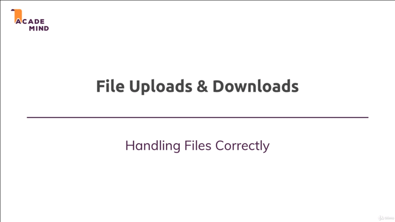

# File Upload & Download

## Table of Contents
1. [Module Introduction](#module-introduction)

 

## Module Introduction
 

 

Now we've know how to work with errors; and now you have learn a lot about
NodeJS ExpressJS in general. Let me dive into a little more advances or
specialized topic _file upload and download_.

It's actually not something that rare you'll often have a feature like this on
your web page, and therefore it is important to understand how you can allow
your _users yo upload files_ and how you can _handle that on your server-side_;
which different possibilities you have for returning files to your users.

So this is essentially what we'll dive into this module. We'll have look at how
to _upload a file and most importantly how to handle them on the server_. Of
course we'll then have a look at the different options you have for returning
(downloading) files.

**[⬆ back to top](#table-of-contents)**
 
 
