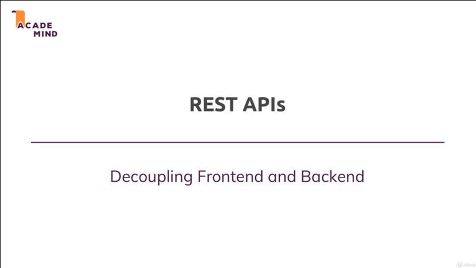

# Working with REST APIs the Basic

## Table of Contents
1. [Module Introduction](#module-introduction)

 

## Module Introduction

You've already learned a lot about NodeJS and how to build amazing application
with it; And the ExpressJS framework it builds up on NodeJS. You've also learn
a lot about _reaching out database_, _handling request_, _sending response_,
_rendering templates_, _working with files_; A lot of crucial things that you
will need for any NodeJS application you're going to build.

Now, I want to move away from one important thing that we always did thus far
and that's the rending of template with EJS. It's common thing to do that in
a lot of NodeJS applications but there also is a very popular alternative kind
of, or a very common over kind of NodeJS application that you'll work with or
that you'll build as a web developer; and that are REST API.
 

 

In this module you'll learn what exactly REST API are, why you would use or
built them instead of the classic NodeJS ExpressJS application, that we built
thus far where we rendered the views.

You'll learn what the _core REST concepts and principles_ are, and we'll build
out first REST API in this module too.

So let's dive in and let's understand what REST APIs are? and why we would well
use them?.
