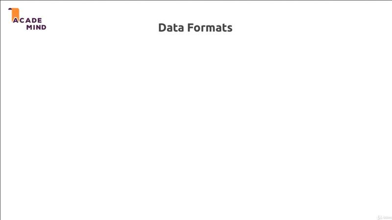

# Working with REST APIs the Basic

## Table of Contents
1. [Module Introduction](#module-introduction)
2. [What are REST API and Why we do use Them](#what-are-rest-api-and-why-we-do-use-them)
3. [Accessing Data with REST APIs](#accessing-data-with-rest-apis)

 

## Module Introduction

You've already learned a lot about NodeJS and how to build amazing application
with it; And the ExpressJS framework it builds up on NodeJS. You've also learn
a lot about _reaching out database_, _handling request_, _sending response_,
_rendering templates_, _working with files_; A lot of crucial things that you
will need for any NodeJS application you're going to build.

Now, I want to move away from one important thing that we always did thus far
and that's the rending of template with EJS. It's common thing to do that in
a lot of NodeJS applications but there also is a very popular alternative kind
of, or a very common over kind of NodeJS application that you'll work with or
that you'll build as a web developer; and that are REST API.
 

 

In this module you'll learn what exactly REST API are, why you would use or
built them instead of the classic NodeJS ExpressJS application, that we built
thus far where we rendered the views.

You'll learn what the _core REST concepts and principles_ are, and we'll build
out first REST API in this module too.

So let's dive in and let's understand what REST APIs are? and why we would well
use them?.

**[⬆ back to top](#table-of-contents)**
 
 

## What are REST API and Why we do use Them
 

 

REST APIs are there to solve one problem you could say, not every frontend user
interface works with HTML-pages or not every user interface might want you
server to generate the HTML code which effectively is user interface.

Think about mobile apps. For example _Twitter app_, thees apps typically don't
work with server-side rendered HTML code. They don't need a templating languages
on the server to render the HTML code, because you build apps with Java for
Android or with Swift object for C for IOS and you use a rich suit of built UI
widget. You use UI libraries provide by Apple or Google and so on.

You use those libraries to build your user interface in the respective IDE of
these programming languages like Android Studio for Android development. You
built these user interface totally decoupled from your server. You don't want
the HTML code because you can't really render it there. Obviously you have
mobile browser too. You have browser on your mobile phone and that will render
HTML-pages but all the apps you install from the App-store most often don't use
HTML to draw the interface; But instead they built the interface with the tools
given to them by Apple or by Google, and then you only need a data to fill these
user interface with live.

Number example would be _single page web apps_ (SPA) you might not have heard of
these but Udemy course player is actually a great example for it. Here's an
example, All the parts on single page web apps do re render without the page
reloading or a page being refreshed. The reason for that is, this entire page is
actually _rendered through browser side JavaScript_; You can of course execute
JavaScript in the browser as you know; And this JavaScript code can manipulate
the DOM (DOM
is simply the rendered HTML code).

What SPA does here is that you only fetch one initial HTML page that does not
really a lot of real HTML content, but that does load all these JavaScript files
script files and then these JavaScript script reach out to some backend RESTFULL
API, and only fetch the data that I need to work with to then re-render user
interface.

So such web application are very popular because they give us a _mobile app like
feeling_. We click around and we don't have to wait for a page refresh. We
always stay on the same page and only the data that gets rendered changes and
they offer only the data is exchanged behind the scenes. All the user interface
rendering is done through browser side JavaScript. So this is another kind of
popular user interface of popular frontend you built these days.

You also might not work on a particular frontend, maybe you are working on
a classic NodeJS application like we did thus far; but you also have certain
**_service API_** that you might want to use like Google Maps API. So here it's
not the frontend that requires us to build a REST API on our own, but this is
another example  of for a case where you only _need the data and no user
interface_. You don't expect Google Maps API to give back the HTML codes; You
might just be interested in some coordinates number.

So again you're interested in the _data_ and that's a common theme here. We have
a frontend where we have code that decoupled from the backend or from certain
backend logic like Google Maps; and we only need to exchange the data, because
we don't want to get any user interface, we don't want to get HTML code. We
built HTML code on our own. **_We just have a backend that needs to serve us data
and that is core idea of building REST API_**; because there we need a different
kind of response.

### A different Kind of Response is Needed.
 

 

REST is stand of _Representational State Transfer_. The simple translation
I like to use is that _we transfer data instead of user interfaces_. Instead of
HTML we just transfer data and we leave it to the client or to the frontend and
be that a mobile app, be that a SPA. We leave it to that frontend to do with
data whatever it wants to do.

Thus far in this course we always rendered the HTML page on the server; and that
of course didn't only include the data, but also already the user interface; And
let me also highlight that this is not bad at all; It's a common pattern for
a lot of web applications but for the other applications you might want to _build
a decoupled frontend_, or you might need to and then REST API are the solution.

It's all important to highlight, that only the response and the request data
changes but not the general server-side logic.

Everything you learn about _validating about reaching out to database_, about
_handling files on the server_; all these things don't change. You do that in
exactly the same way when building a REST API; And that it's really important to
me because _often_ REST API and traditional web apps, where you rendered of
views on the server are seen two totally different things, they are not, they
only differ in the response and in the kind of data you expect. But the don't
differ in what happens on the server, besides the fact that you don't render the
view there, and that's really important. This is also of course why what you
learned thus far is now not redundant. Actually we'll reuse 99% of the
knowledge. We'll only _tune our data usage or data handling_; And to response
a little bit

**[⬆ back to top](#table-of-contents)**
 
 

## Accessing Data with REST APIs
 

 

We know what are REST API generally is, or which problem it solves. Let me give
you a big picture of how REST API works.

We have a client and server, the client is _mobile app_ or _SPA_, _on the server
we built our API_. So here we build an API for these apps we might be building;
And one advantage by the way is, we can use in the same API for multiple
clients. So we might be building a web app and mobile app, not that uncommon
these days. Most companies have mobile apps and web apps but we can use one at
the same API, because both apps use the same data.

They might present it differently and that is what I was talking about. About
the user interface being handled by the frontend by the client. They might
present it differently but they work with the same data.

So that is our API we might be building. Or we might have any kind of app
including our traditional web app, which just need a _service API_ or we might
be building our own service API, maybe to also sell our services. Maybe were
building a _stock API_ where any application which we might not even know is
able to query data from; And we just sell access to that API, that is our
business model.

All this cases, we obviously exchange something and the something we exchange is
_data_ as I mentioned before. _Only the data not the user interface_; and that
of course leads us to one important question in which format do we exchange that
data?.

### Data Formats
 

 

We've learned about HTML this far, but there are different kinds of _data we
could attach to a request and a response_. We can send _plain text_ for example,
we could send some _XML_, we could send _JSON_, and there are other formats too,
but these are some well-known format.

#### HTML

HTML of course look something like `
Node.js
`. We can send HTML code, and
this is what we did thus far in the course, when we rendered EJS to what we
essentially did is we sent HTML code to the browser, because the view rendered
on the server, and the result of that rendering process simply was HTML page or
HTML code.

So this is how we could send data. HTML code contains both the _data and the
structure_ of course. The HTML elements, the CSS style we might be adding; that
all adds structure and designs, and what's between HTML elements is our data. So
therefore does also _contains our user interface_. It defines how our user
interface should look like.

The problem is of course if we just want the data, we got all the overhead all
the HTML content. It's unnecessarily difficult to parse, because even thought
the HTML elements are of course defined and regulated; how we use them and how
we well structure our documents is not really enforced on to us. It's
unnecessarily difficult to parse

#### Plain Text

If we only need the data, we can of course send a _plain text_. The thing
here's, this is only data of course, there's no structure, there's no design
element at it, and therefore we make no user interface; and that as user
interface of course we make no UI assumptions.

Still if you want to transfer data with Plain Text, it's unnecessarily difficult
to parse, because text is easier to understand for humans, but for computer it
isn't. There's no clear pattern in the Plain Text, and therefore it's not really
great way of exchanging data.

#### XML

XML looks a lot like HTML and actually HTML is special kind of XML you could
say. The differences is, XML allows you to use any text; And of course with XML
allows you to transfer data.

It's also not making any UI assumptions, because it's not possible by the
browser. The XML elements are totally made up by you.

The good thing is, it's easier to read by machines then plain text. You can also
of course define clear structure there, but you'll need a special XML parser,
because traversing true an XML node tree is kind of challenging, not impossible
to solve, but you need a special parser; And all these elements of course add
some _overhead to the data you transfer_.

There's a lot of extra text that is only required to read your data, that's not
really your core data though.

#### JSON

The last data format and you might already guess that will be our winner, is
JSON, looks like `{"title": :Node.JS}`. We already used in this course. When we
had a look at asynchronous request, at couple of module ago.

This also transfer only a data, It makes no UI assumptions, and it's also
machine readable.

The good thing is, it's a but more concise than XML, and it can be easily be
converted to JavaScript, and that's of course a huge plus when working with
NodeJS on the server; But also with well JavaScript in the browser (frontend)
which happens to be our only programming language we can use there.

Therefore, this us our winner data format. If we just want to transfer data and
see the most common format in API you communicating with these days. All the
other formats are not asked great for transmitting data as JSON is.

Therefore JSON is what we'll use. It's important for you to understand why we
use it, and I hope this became clear.

**[⬆ back to top](#table-of-contents)**
 
 

