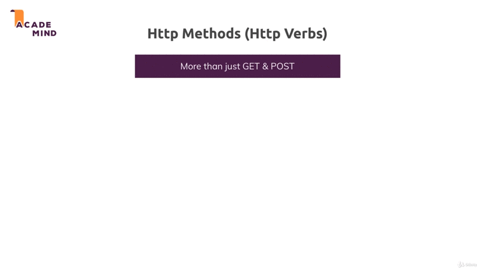

# Working with REST APIs - The Basic

## Table of Contents
1. [Module Introduction](#module-introduction)
2. [What are REST API and Why we do use Them](#what-are-rest-api-and-why-we-do-use-them)
3. [Accessing Data with REST APIs](#accessing-data-with-rest-apis)
4. [Understanding Routing HTTP Method](#understanding-routing-http-method)
5. [REST Principles](#rest-principles)
6. [REST API Clients CORS Errors](#rest-api-clients-cors-errors)
7. [Module Summary](#module-summary)

<br/>

## Module Introduction

You've already learned a lot about NodeJS and how to build amazing application
with it; And the ExpressJS framework it builds up on NodeJS. You've also learn
a lot about _reaching out database_, _handling request_, _sending response_,
_rendering templates_, _working with files_; A lot of crucial things that you
will need for any NodeJS application you're going to build.

Now, I want to move away from one important thing that we always did thus far
and that's the rendering of template with EJS. It's common thing to do that in
a lot of NodeJS applications but there also is a very popular alternative kind
of, or a very common over kind of NodeJS application that you'll work with or
that you'll build as a web developer; and that are REST API.
<br/>


<br/>

In this module you'll learn what exactly REST API are, why you would use or
built them instead of the classic NodeJS ExpressJS application, that we built
thus far where we rendered the views.

You'll learn what the _core REST concepts and principles_ are, and we'll build
out first REST API in this module too.

So let's dive in and let's understand what REST APIs are? and why we would well
use them?.

**[⬆ back to top](#table-of-contents)**
<br/>
<br/>

## What are REST API and Why we do use Them
<br/>


<br/>

REST APIs are there to solve one problem you could say, not every frontend user
interface works with HTML-pages or not every user interface might want you
server to generate the HTML code which effectively is user interface.

Think about mobile apps. For example _Twitter app_, thees apps typically don't
work with server-side rendered HTML code. They don't need a templating languages
on the server to render the HTML code, because you build apps with Java for
Android or with Swift object for C for IOS and you use a rich suit of built UI
widget. You use UI libraries provide by Apple or Google and so on.

You use those libraries to build your user interface in the respective IDE of
these programming languages like Android Studio for Android development. You
built these user interface totally decoupled from your server. You don't want
the HTML code because you can't really render it there. Obviously you have
mobile browser too. You have browser on your mobile phone and that will render
HTML-pages but all the apps you install from the App-store most often don't use
HTML to draw the interface; But instead they built the interface with the tools
given to them by Apple or by Google, and then you only need a data to fill these
user interface with live.

Number example would be _single page web apps_ (SPA) you might not have heard of
these but Udemy course player is actually a great example for it. Here's an
example, All the parts on single page web apps do re render without the page
reloading or a page being refreshed. The reason for that is, this entire page is
actually _rendered through browser side JavaScript_; You can of course execute
JavaScript in the browser as you know; And this JavaScript code can manipulate
the DOM (DOM
is simply the rendered HTML code).

What SPA does here is that you only fetch one initial HTML page that does not
really a lot of real HTML content, but that does load all these JavaScript files
script files and then these JavaScript script reach out to some backend RESTFULL
API, and only fetch the data that I need to work with to then re-render user
interface.

So such web application are very popular because they give us a _mobile app like
feeling_. We click around and we don't have to wait for a page refresh. We
always stay on the same page and only the data that gets rendered changes and
they offer only the data is exchanged behind the scenes. All the user interface
rendering is done through browser side JavaScript. So this is another kind of
popular user interface of popular frontend you built these days.

You also might not work on a particular frontend, maybe you are working on
a classic NodeJS application like we did thus far; but you also have certain
**_service API_** that you might want to use like Google Maps API. So here it's
not the frontend that requires us to build a REST API on our own, but this is
another example  of for a case where you only _need the data and no user
interface_. You don't expect Google Maps API to give back the HTML codes; You
might just be interested in some coordinates number.

So again you're interested in the _data_ and that's a common theme here. We have
a frontend where we have code that decoupled from the backend or from certain
backend logic like Google Maps; and we only need to exchange the data, because
we don't want to get any user interface, we don't want to get HTML code. We
built HTML code on our own. **_We just have a backend that needs to serve us data
and that is core idea of building REST API_**; because there we need a different
kind of response.

### A different Kind of Response is Needed.
<br/>


<br/>

REST is stand of _Representational State Transfer_. The simple translation
I like to use is that _we transfer data instead of user interfaces_. Instead of
HTML we just transfer data and we leave it to the client or to the frontend and
be that a mobile app, be that a SPA. We leave it to that frontend to do with
data whatever it wants to do.

Thus far in this course we always rendered the HTML page on the server; and that
of course didn't only include the data, but also already the user interface; And
let me also highlight that this is not bad at all; It's a common pattern for
a lot of web applications but for the other applications you might want to _build
a decoupled frontend_, or you might need to and then REST API are the solution.

It's all important to highlight, that only the response and the request data
changes but not the general server-side logic.

Everything you learn about _validating about reaching out to database_, about
_handling files on the server_; all these things don't change. You do that in
exactly the same way when building a REST API; And that it's really important to
me because _often_ REST API and traditional web apps, where you rendered of
views on the server are seen two totally different things, they are not, they
only differ in the response and in the kind of data you expect. But the don't
differ in what happens on the server, besides the fact that you don't render the
view there, and that's really important. This is also of course why what you
learned thus far is now not redundant. Actually we'll reuse 99% of the
knowledge. We'll only _tune our data usage or data handling_; And to response
a little bit

**[⬆ back to top](#table-of-contents)**
<br/>
<br/>

## Accessing Data with REST APIs
<br/>


<br/>

We know what are REST API generally is, or which problem it solves. Let me give
you a big picture of how REST API works.

We have a client and server, the client is _mobile app_ or _SPA_, _on the server
we built our API_. So here we build an API for these apps we might be building;
And one advantage by the way is, we can use in the same API for multiple
clients. So we might be building a web app and mobile app, not that uncommon
these days. Most companies have mobile apps and web apps but we can use one at
the same API, because both apps use the same data.

They might present it differently and that is what I was talking about. About
the user interface being handled by the frontend by the client. They might
present it differently but they work with the same data.

So that is our API we might be building. Or we might have any kind of app
including our traditional web app, which just need a _service API_ or we might
be building our own service API, maybe to also sell our services. Maybe were
building a _stock API_ where any application which we might not even know is
able to query data from; And we just sell access to that API, that is our
business model.

All this cases, we obviously exchange something and the something we exchange is
_data_ as I mentioned before. _Only the data not the user interface_; and that
of course leads us to one important question in which format do we exchange that
data?.

### Data Formats
<br/>


<br/>

We've learned about HTML this far, but there are different kinds of _data we
could attach to a request and a response_. We can send _plain text_ for example,
we could send some _XML_, we could send _JSON_, and there are other formats too,
but these are some well-known format.

#### HTML

HTML of course look something like `<p>Node.js</p>`. We can send HTML code, and
this is what we did thus far in the course, when we rendered EJS to what we
essentially did is we sent HTML code to the browser, because the view rendered
on the server, and the result of that rendering process simply was HTML page or
HTML code.

So this is how we could send data. HTML code contains both the _data and the
structure_ of course. The HTML elements, the CSS style we might be adding; that
all adds structure and designs, and what's between HTML elements is our data. So
therefore does also _contains our user interface_. It defines how our user
interface should look like.

The problem is of course if we just want the data, we got all the overhead all
the HTML content. It's unnecessarily difficult to parse, because even thought
the HTML elements are of course defined and regulated; how we use them and how
we well structure our documents is not really enforced on to us. It's
unnecessarily difficult to parse

#### Plain Text

If we only need the data, we can of course send a _plain text_. The thing
here's, this is only data of course, there's no structure, there's no design
element at it, and therefore we make no user interface; and that as user
interface of course we make no UI assumptions.

Still if you want to transfer data with Plain Text, it's unnecessarily difficult
to parse, because text is easier to understand for humans, but for computer it
isn't. There's no clear pattern in the Plain Text, and therefore it's not really
great way of exchanging data.

#### XML

XML looks a lot like HTML and actually HTML is special kind of XML you could
say. The differences is, XML allows you to use any text; And of course with XML
allows you to transfer data.

It's also not making any UI assumptions, because it's not possible by the
browser. The XML elements are totally made up by you.

The good thing is, it's easier to read by machines then plain text. You can also
of course define clear structure there, but you'll need a special XML parser,
because traversing true an XML node tree is kind of challenging, not impossible
to solve, but you need a special parser; And all these elements of course add
some _overhead to the data you transfer_.

There's a lot of extra text that is only required to read your data, that's not
really your core data though.

#### JSON

The last data format and you might already guess that will be our winner, is
JSON, looks like `{"title": :Node.JS}`. We already used in this course. When we
had a look at asynchronous request, at couple of module ago.

This also transfer only a data, It makes no UI assumptions, and it's also
machine readable.

The good thing is, it's a but more concise than XML, and it can be easily be
converted to JavaScript, and that's of course a huge plus when working with
NodeJS on the server; But also with well JavaScript in the browser (frontend)
which happens to be our only programming language we can use there.

Therefore, this us our winner data format. If we just want to transfer data and
see the most common format in API you communicating with these days. All the
other formats are not asked great for transmitting data as JSON is.

Therefore JSON is what we'll use. It's important for you to understand why we
use it, and I hope this became clear.

**[⬆ back to top](#table-of-contents)**
<br/>
<br/>

## Understanding Routing HTTP Method
<br/>


<br/>

We've learned what the core idea is and how we transfer data and that is King in
REST API, let's have look the routing. How do we communicate between client and
server?.

We've client-server, and on the server we've our _sort of logic_, we _reach out to
databases_, and so on.

We send the request from the client to the server, how we do that? Well in
a traditional web app, as we built it thus far, of course we did it by simply
adding a link `a href=` on our HTML page, for example; or we've a `<form>` with
a `<button>` and we defined the form `action` and form `method`. Well it's not
that far off for REST API. We still send the request to a combination of _HTTP
method_ also called HTTP world; and a path onto a server. What we defined thus
far still will be used kind of, we still find such path on the server side
routing where we wait for incoming request; and we also define certain HTTP
method we want to handle for this path. Not all request can reach all POST.

These request would be sent from the client (when working on the browser)
through Asynchronous JavaScript, with the _fetch API_, for example; or with
AJAX, and on mobile apps, and so on. We all get special clients.

The core thing here is we in the end still sent a _normal requests_. These are
totally normal request that just don't expect any HTML response, and we send
a combination of _HTTP method_ and _path_. This is how we communicate with our
server.

In the REST world or in the API wild we like to call these things your _API
Endpoints_. So when you here me talked about an API Endpoints, I'm talking about
combination of HTTP method, like POST and GET and the respect of _path_ or
written like `GET /posts/:postid`. These already Endpoints, we define on our
REST API. We defined a logic that should execute on the server when a request
reaches such Endpoints.

### HTTP Verbs
<br/>


<br/>

Talking about HTTP method, there are more methods that just _GET_ and _POST_.
I did mention this before in the course, but when working with the browser only,
and not with JavaScript in the browser, Just with `forms` and `links`; then we
only have GET and POST available. These are the two methods the browser natively
knows or the browser HTML elements knows.

When using asynchronous requests for JavaScript or when building mobile apps and
so on, using their respective HTTP clients, you have to access to more HTTP
methods. We actually already saw that in the asynchronous request module of
course.

Besides GET, which is responsible _getting a resource from the server_; And POST,
which is _responsible for posting a resource to the server_ which means create
it on the server or append it to existing, let's say array of resources.

We have access to PUT, which we would use if we want to put a resource onto the
server which means you want to created or overwrite an existing resource. POST
will never overwrite or should never overwrite.

We also have access to PATCH, which is used for updating parts of an existing
resource, so not override it entirely necessarily but update parts of it.

We have access to DELETE, which allows us to delete a resource on the server.

We also have a special method called OPTIONS, which we will use too in this
module. Indirectly though it is sent automatically by the browser and there will
come back to it. This basically is a request which the browser will send
automatically to find out, if the next request tries to do, for example DELETE
something if that is actually allowed and it will come back to that.

These are HTTP method we'll works with. The method we typically work with when
building a REST API. Especially the first five ones; the orange ones are
important.

I also want to highlight, that in theory you can do whatever you want when
a request with a certain method reaches a certain path.

For the REST world, we should use a POST request to create or append a resource.
No one is stopping you from deleting something on a server, because ultimately
you only _define a method path pair_ on your server-side, and then you run any
code you want; And what happens with that code is not restricted by the method
that was used to execute that code. You can restricted yourself and you want to
implement the REST API that follows these idea here, but you don't have to; And
that's just important to highlight.

It's common and it's good practice, it's bets practice to use these methods in
this way, because then anyone who's using your API clearly knows what to expect
to happen on the server for a given method; But in theory no one is stopping you
from doing something else.

**[⬆ back to top](#table-of-contents)**
<br/>
<br/>

## REST Principles
<br/>


<br/>

We're almost done with the theory part. Now there are some **_core principles_**
that are indeed defined in theory, and that are important to you to keep in
mind, where at least there are two core principles, I want you to keep in mind
When building the REST API.

### Uniform Interface

This principles simply define that your API will have or should have clearly
_defined API Endpoints. You remember Endpoints were the combination of HTTP
method and Path_, with clearly defined request and response data structure. We
put in another words, your API should be predictable and if possible and if open
to the public it should all be well documented.

People should know which data does your API expect, which data does it gives
back, which Endpoints do I have; And the thing that happens when a request
reaches to Endpoints should of course not change overtime. It should be
predictable, it should be clearly defined.

### Stateless Interactions

This is _super important_ when we later talk about _authentication_. When
building a REST API the server and client are totally separate, that they don't
share common history. So _no connection history is stored_, and _no session will
be used_ therefore. Because every incoming request is treated as if no prior
request were sent. The server has a look at every request on it's own. It does
not store as session for a client. It does not care about the client at all
actually. That is also a cool thing about REST API.

You can build REST API, open it up to the public, like Google Maps API's, for
example; And you don't care about the individual client. You just say 'Hey, here
are the Endpoints I have; Here's the data you get back for each Endpoints;
Here's the data I expect from you for my Endpoints, and then I don't care about
you; I don't store the session with you'.

We have strong decoupling of the client and the server; Even if the were to run
on the same server, because we're building our own API for our own frontend. We
still would decoupled both, so that they work independently and just exchange
data. This means, that every time we set up a new Endpoints we have to make sure
that works independent from prior requests. A typical problem here is
authentication where once we locked in future request should be treated locked
in; And I will show you how to solve this in this course too of course.

Now other principles which are less important which you don't need to lean by
hard, like below:

### Cacheable

It means, on your REST API you could send back some headers that tell the client
how long the response is valid, so that the client may cached a response.

### Client-Server

Client server separation is mentioned again here. It's more thinking about the
data storage. Client and server are decoupled as a set; and the client should
not worry about persistent data storage therefore. The server will  be
responsible for this.

### Layered System

Is simply means, as a client when we send the request to an API we can't rely on
that server. We sent it to immediately handling the request to server might
instead forward the request or distribute it to another server. Ultimately we
only care about the data we get back, which should of course follow the
structure that was defined by the API.

### Code on Demand

This is means, the REST API could also for some Endpoints transfer executable
code to the client.

To be honest in reality you don't see that too often we're mostly talking about
normal data we're using; but still these are the best principles the top two
ones are the important ones, which will have great implications especially on
authentication.

**[⬆ back to top](#table-of-contents)**
<br/>
<br/>

## REST API Clients CORS Errors
<br/>


<br/>

Often as you build an REST API you get an error: `No
'Access-Control-Allow-Origin'` in your frontend, or in your client-side
JavaScript. This is an error you see a lot when building modern web
applications, modern SPA, and it often leads to a lot of confusion.

Now what is CORS? And what's causing it? And most importantly how can we solve
it?.

CORS stand for _Cross Origin Resource Sharing_, and by _default this is not
allowed by browsers_.

If you have a client in the server and they run with the same domain and the
domain could be `localhost:3000`; Important, the port as part of the domain, if
they run on the same server we can send requests and responses as we want to,
without issues; and that is why we had no issue before in the course. We
rendered our HTML files on the server and therefore they were served by the same
server as you send your requests to. So we never had any issues.

However, if client-server run on different domains, like the client on
`localhost:4000`, which is different domain with the server, it's run on
`localhost:3000`, then _we'll have issues_.

Of course, in production you would run on `my-app.com`, and let's say
`my-api.com`; if you send requests and response here, you get problem; you get
a _CORS error_, because it's a security mechanism provided by the browser, that
_you can't share resource across domains, across service, across origin_, as it's
called here.

However we can overwrite this, because this mechanism makes senses for some
applications; for _REST API typically does not_. We want to allow our server to
share its data. We _want to offer data from our server to different clients_,
and _these client will often bot be served by the same server as our API runs
on_. For example, we take Google Maps, you're not running tour app on Google's
service, but still you can access it; And the same is true, for your own API,
and even if you built both the frontend and backend you will often serve the two
ends from different service, because you can choose a server for the
frontend that optimize for frontend-code, that really servers that really well,
and you serve your server-side code your NodeJS code from different server. So
you'll have different domains, different addresses there too.

Therefore, we need to solve such a CORS error, or we need to tell the browser,
that it _may accept the response_ sent by our server, and to tell the browser
we have to change on the server.

This is a common gotcha. A lot of people see that error, and want to _solve it in
their browser side JavaScript code, You just can't_. **_You can only solve on the
server_**.


you just add some special `setHeader`. We want set this headers on any response
that leaves our server.  So [app.js](./../project-19/app.js) the general
middleware is a great place.

So you add the `Headers` before you forward request to `feedRoutes`, where
I ultimately send the response, I want to add a `Headers` to any response,
I setup a general middleware like this,

```javascript
app.use((request, response, next) => {
    response.setHeader("Access-Control-Allow-Origin", "*");
    response.setHeader("Access-Control-Allow-Methods", "GET, POST, PUT, PATCH, DELETE");
    response.setHeder("Access-Control-Allow-Headers", "Content-Type, Authorization");

    next();
});
```
**[⬆ back to top](#table-of-contents)**
<br/>
<br/>

## Module Summary
<br/>


<br/>

That's it for the basics of REST API, we'll dive much deeper into REST API, and
build a real project with REST API in the next module.

The core concept are that REST API, _all about data_, _no user interface logic
is exchange_. REST API are normal node service though; that is really important
to keep in mind, we're not building totally different kind of apps of a sudden.
Just the data format and the way we send response changes, because now we simply
expose of Endpoints, which is a combination of _HTML method and path_; but we
did this before too. We just have more methods available now, and we exchange
data in JSON format, for both request and responses. We don't return HTML pages
as a response anymore.

REST API are decoupled from the client stuff, they are totally decoupled. They
don't share any connection history, or store any connection history.


When we have a look at the request and response, it's important to understand.
That you **_should attach data_**, for request and response in JSON format; and
that you should let the other end know by setting "Content-Type"  header.
ExpressJS just run automatically when using the `.json()` method in the browser.
It depends on which method you use when using the `fetch` API. We had to set it
manually when you would use Axios, another common libraries in browser side
JavaScript for sending _Async request_, it would be done automatically.

CORS error are also something we had to look at. They occur when the API and
your client are sitting on different service or different domains, and they want
to exchange data. You fix them in quotation mark, because they are security
mechanism; But you can bypass that on purpose by setting the right CORS-Headers;
which basically tell the client 'hey it's fine, I'm a public API, you may use my
data'.

These are the basic, let's dive much deeper into REST API. Using different HTTP
method, add authentication on it, and so on, by working on a real project.


