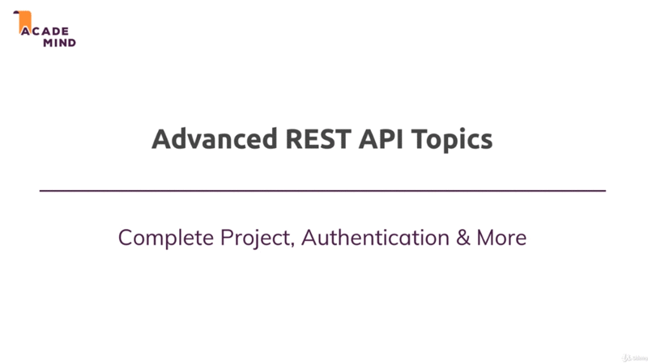

# Working with REST APIs - The Practical Application

## Table of Contents

1. [Module Introduction](#module-introduction)

 

## Module Introduction
 

 

So, it's time to dive deeper into your REST API and build a complete project or
a complete backend-forth project as REST API; And in this project we'll have
a look a things like _authentication_ and other interesting things like _image
upload_ and so on.

What's in this module in detail, we'll plain our REST API, or I'll show you for
which you'll need want and will then build it together of course.

In detail, we'll implement all the CRUD operation to our project needs. So
_creating_, _reading_, _updating_ and _deleting_ items in a database and so on.
That's what we'll do here, we'll define all the REST API Endpoints for this and
so on.

We'll add validation on the server-side to make sure that only valid data gets
stored in our database.

We'll add image upload, so that we still can store images even though we're not
rendering views anymore.

Finally we'll dive into authentication, which will be very important and very
interesting too.

**[⬆ back to top](#table-of-contents)**
 
 

