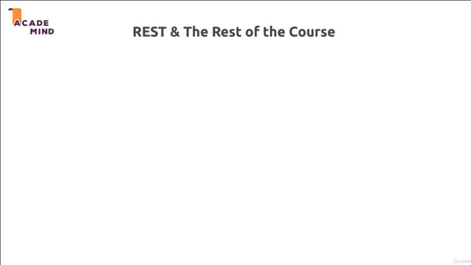

# Working with REST APIs - The Practical Application

## Table of Contents

1. [Module Introduction](#module-introduction)
2. [REST API and The Rest of the course](#rest-api-and-the-rest-of-the-course)

 

## Module Introduction
 

 

So, it's time to dive deeper into your REST API and build a complete project or
a complete backend-forth project as REST API; And in this project we'll have
a look a things like _authentication_ and other interesting things like _image
upload_ and so on.

What's in this module in detail, we'll plain our REST API, or I'll show you for
which you'll need want and will then build it together of course.

In detail, we'll implement all the CRUD operation to our project needs. So
_creating_, _reading_, _updating_ and _deleting_ items in a database and so on.
That's what we'll do here, we'll define all the REST API Endpoints for this and
so on.

We'll add validation on the server-side to make sure that only valid data gets
stored in our database.

We'll add image upload, so that we still can store images even though we're not
rendering views anymore.

Finally we'll dive into authentication, which will be very important and very
interesting too.

**[⬆ back to top](#table-of-contents)**
 
 

## REST API and The Rest of the course
 

 

Before we start working on the project, let me quickly have a look at REST API's
and the other knowledge you gained through out the course, is that now all
redundant. We learn about things like _setting up our NodeJS and  ExpressJS
apps_, like _routing_, _handling request-response_, _request validation_,
_database communication_, _file handling_, _uploads - downloads_, _session and
cookies_, and _authentication_.

Above all some big topics we covered for the course. Now how do we have to
adjust our knowledge? Now we build a RESTFUL API instead of a view based
application.

Well regarding the general setup, we already saw that in the last
module there are no changes we need  to do. We still setup our normal node and
express server.

Regarding the routing we also have no significant changes. We just use more HTTP
methods, more HTTP works now, that's the only different.

For handling request and responses that you've already learn. Now we work with
JSON data `.json()` instead of views. So that is a difference, we render no
views anymore. We have no views folder anymore, we don't use EJS, Handlerbars
or anything like that, instead we only exchange data; so there's a change, but
as you learned in the last module, this is also not too hard to implement.

Now, if you want to add validation for incoming request data, then we'll not
have to change anything. We still can add validation, for example with
`express-validator` which we used in the validation module of this course; and
the way we use it, and the logic behind it, does not change a single bit.

For database communication; So working with database, be that SQL or NoSQL
database also does not change. This happen on the server-side, in a controller
action typically, and the logic we write there, the code we write there is not
affected by the data we change, or by the fact whether we render a view or if
we send around JSON data.

When we talk about file uploads, downloads and so on, there's also not much to
changes. On the server-side, nothing changes actually, on the client-side the
logic changes a little bit, and I will show you how we can implement file
upload; and of course also serving files in this module.

For session and cookies, there we have changes, because we'll not use session
and cookies anymore with REST API; The reason for that simply is that you
learned about these RESTFUL principles, or REST API principles, and one of them
was, that each request is treated separately. It is looked at independently from
previous requests, so we have no connection between the client and the server.
WE have no shared connection history to be precise; And therefore we managed no
session on the server, because the REST API does not care about the clients, or
whether that client connected to API before.

Therefore authentication will also have to change. We'll use a different
authentication approach, and I'll show you which approach does this, and how to
implement it in this module too.

Overall there are not too many changes. Some changes, the biggest changes are
related to _sessions_, and they are for _authentication_, and I'll show you how
to implement them, but the rest will still work the same you learn it; And for
all the knowledge you gained through the Course, is of course everything but
redundant, it's still super important.

With that, let's dive in, let's see which project will be work on, and how we
can work on it.

**[⬆ back to top](#table-of-contents)**
 
 

