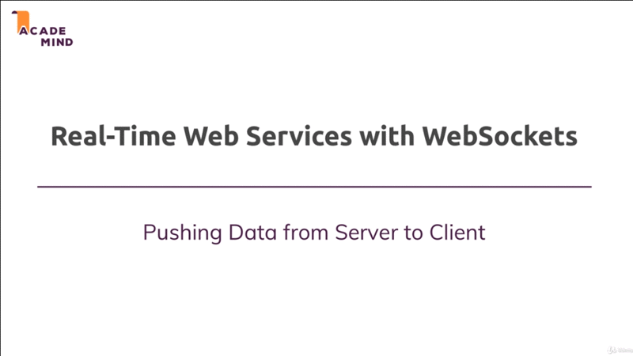
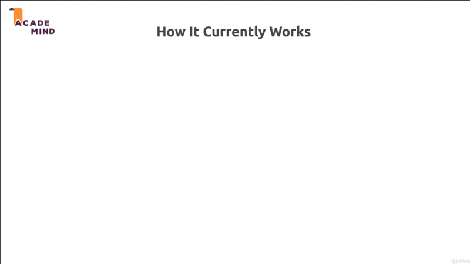
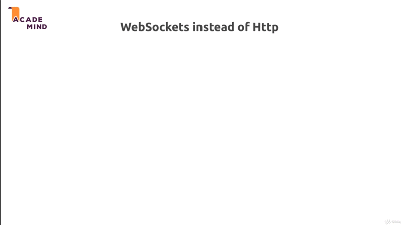

# Understanding WebSocket socket.io

## Table of Contents
1. [Module Introduction](#module-introduction)
2. [What are WebSocket Why You Use Them](#what-are-websocket-why-you-use-them)

 

## Module Introduction
 

 

A lot of exciting things were covered in the last modules, REST API,
async-await, and we'll continue on that road. We'll dive into a very exciting
technology that you can use in NodeJS applications, WebSocket.

WebSocket are a nice way, a protocol essentially which allows us to build
real-time Web Services. Now what exactly does that mean? How does it work?.
That's what we'll cover in this module.

You'll learn why you would want to use real-time Web Services? And what that
actually is?, and we'll see how we add real-time communication to our NodeJS app
or to any NodeJS app, of course we'll use a certain library fro that
`socket.io`, and I will teach you everything you need to know about, why to use
it, how it works, what you can do with `socket.io`, and how you use it in your
project.

**[⬆ back to top](#table-of-contents)**
 
 

## What are WebSocket Why You Use Them
 

 

Let's start with status quo, how does our application we both thus far work? And
with that, I'm not just referring to that REST API, but to the shop we built
before that to. How do typically NodeJS or NodeJS ExpressJS application work?.

We get our client, we got our server. The client would be our browser, mobile
phone, or something like that. The server is of course essentially what we built
our NodeJS application. Now Thus far, we always sent the request from the
client. We waited for this request on the server. We setup some routes to handle
different kinds of requests.

Once we're done doing something on the server, for example reach out to
a database, we send back a response to the client. So first `[1]` request then
`[2]` response. That how our application works thus far, and this is how most
web application work; And by the way, we're not going to replace it with
something totally new, which will then use all the time. This is a fine pattern,
because a lot of resources on the internet should be available by this _pull
approach_.

So, you pull information from the client, you tell the server that you want
something, this is a typical approach and is a fine approach. But sometimes you
have different requirement. What if you want to send something from the server
to client, so what if something happens and you want to inform the client? Let's
say you're building a _chat application_, `User [a] ` on a `PC [a]` or on his
mobile phone, sends a message to `User [b]`. Now obviously they're not sharing the
same device. They might be in two totally different places on the world.

Now `User [a]` send request to the server that contains the message and the
server restore the message in database, and the server can return a response to
`User [a]`; But `User [b]` the person with whom `User [a]` chat does not send
the request to the server asking for the message or at least that is unlikely to
happen. You could certainly use some patterns where you send the request every
second to see if there are new messages; But you'll then hammer your server with
requests, were most request will not yield new messages.  So, instead it would
be nice to have some _push way off informing_ `User [b]` about the new message.
That is exactly the scenario we're looking at here.

### WebSockets instead of HTTP
 

 

What if something changed on server, and we actively want to inform a client?
Well then, we can use WebSockets instead of HTTP.

HTTP is the protocol we use thus far. Where we send the request and we get
a response. WebSockets built up on HTTP, they are established via HTTP, They use
a so-called _HTTP handshake_ to upgrade the HTTP protocol to the WebSockets
protocol, and the WebSocket protocol, and the WebSocket protocol, that simply
**_talks about how data is exchange_**, right. So WebSocket protocol is
something you don't have to manage actively.

The browser and the server communicate through a protocol, and they use protocol
defines how the communication can happen. With HTTP it's request response, with
WebSocket it is **_push data_**; were It's actually both. We can also send data
from the client to the server, this is still included; But most importantly, and
that's a feature I really want to highlight here. We can push data from the
server to declined; and you can push, and you typically will use both together
in one in the some Node app.

So, it's not like you have to decide, do I build an app with WebSockets? Or do
I build one with HTTP?. You still have a lot of places, where you want to use
that request response pattern; for example, if you were sending a message or if
you're creating a user. These are operations where you do send some information
from the browser to the server. So there is a request response scenario makes
perfect sense. But if you have some active notification, you want to get tour
users, then you all want to integrate WebSockets.

Now, let me show you how to add WebSockets to your project in the next lecture.

**[⬆ back to top](#table-of-contents)**
 
 
