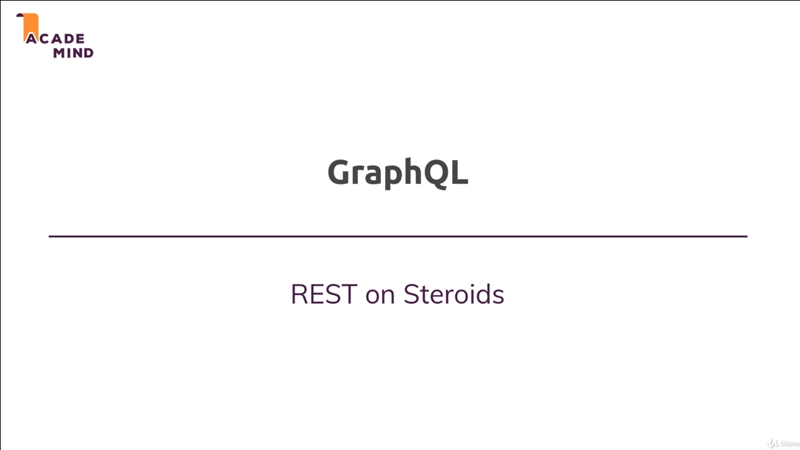
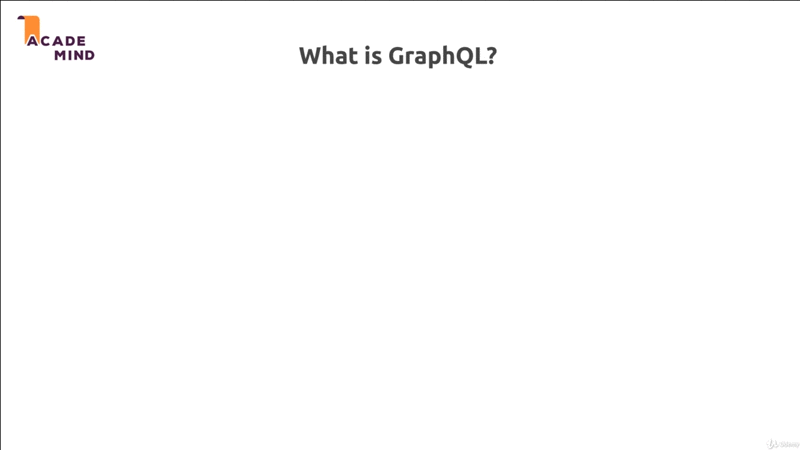
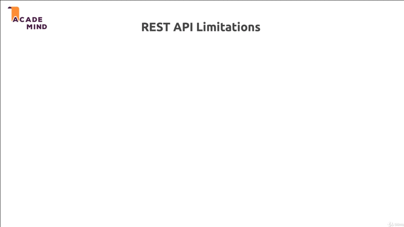
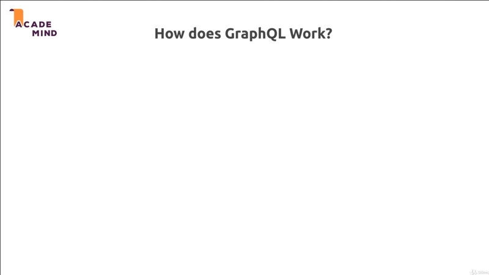
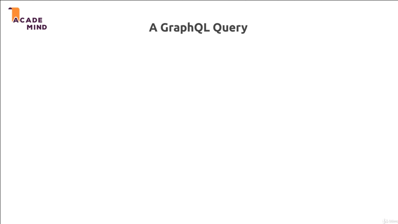
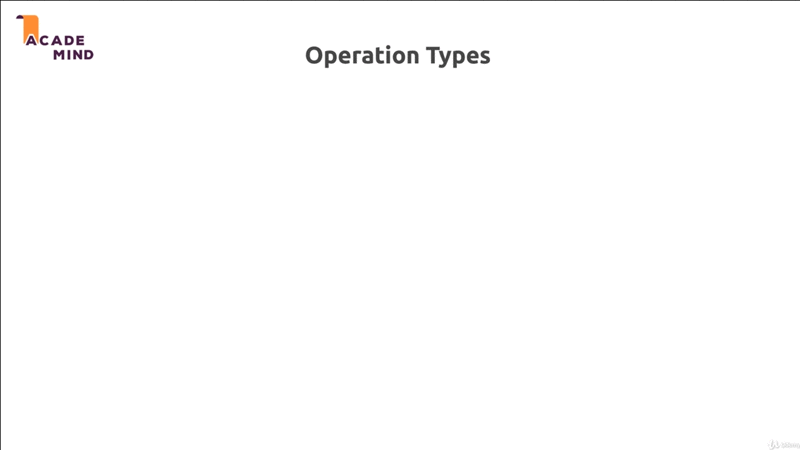
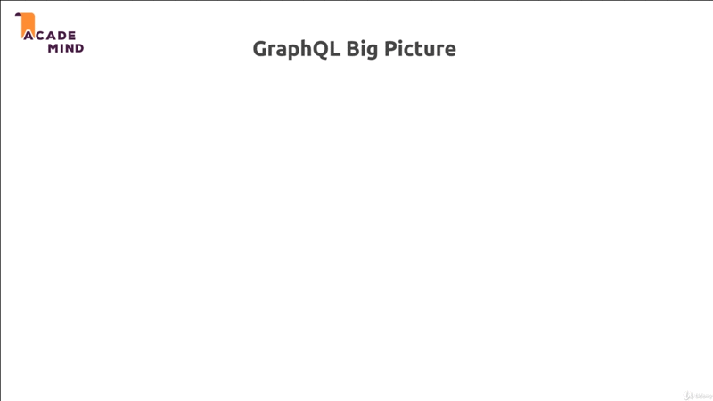
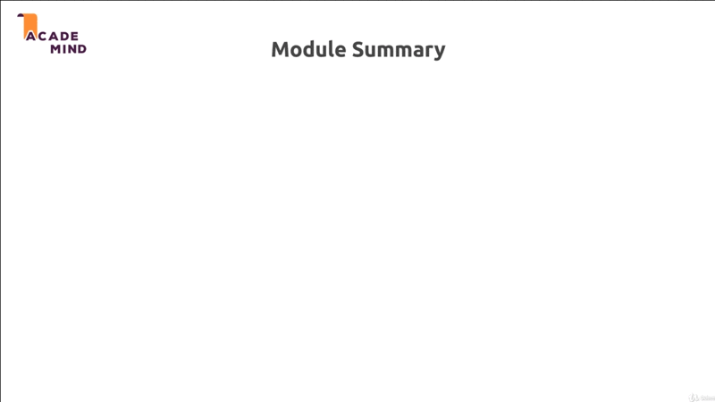

# Working With GraphQL

## Table of Contents
1. [Module Introduction](#module-introduction)
2. [What Is GraphQL](#what-is-graphql)
3. [Module Summary](#module-summary)

 

## Module Introduction
 

 

Welcome to this module, the best things always come at the end. In this module.
I want to dive into an exciting piece of technology with you, we'll dive into
GraphQL. It's an alternative to building a RESTFUL API that you would use in the
same scenarios.

So, when you have de-coupled frontend and backend, you will not render views
with GraphQL API to, but it provides some significant advantages over REST API;
at least in certain scenarios.

In this module, we'll explore what GraphQL actually is, and how it compare to
REST API, and you'll learn how to use GraphQL of course. We'll actually take our
existing project and turn it into GraphQL API, or use GraphQL API.

It's a very excited technology, I'm super excited to get started with it.

**[⬆ back to top](#table-of-contents)**
 
 

## What Is GraphQL
 

 

To really explain what's GraphQL is, let's compare it to REST API, which we
already learn about. A REST API is a **_stateless client independent for
exchanging data_**.

So, it's a NodeJS ExpressJS application or a NodeJS with any frameworks
application of course, that we build to exchange data. We _don't render views_, we
_don't store session_, we _don't care about the client_. We only get request,
parse the data and return response with data, typically JSON data.

GraphQL API is generally not that different. It's also a stateless client
independent API for exchanging data. But, and that's the important part of
course, with  **_higher query flexibility_**.

### REST API Limitation
 

 

To understand that, let's look at some REST API limitation. Let's say in our
REST API we have Endpoint `GET/POST`, we can send a GET request to slash
`/post`, and as you might imagine, this was fetch a POST, to let's say from the
database, but could also be from a file or anything like JSON; And this is how
a POST might look like.

Now, we returned JSON to the client, and everyone is happy. But what if we
actually only need to `title` and `id` on the client? What if we don't need the
`content` or we don't need to `creator` data (object), we can of course have
many scenarios where we use one at the same Endpoint in our frontend
application; So in our single-page application or our mobile application and in
one place on one page, we might need `title` and `content`; on the other page we
might need `content` and `creator`, how we can solve that?

Well solution `[1]` is of course, to simply _create more Endpoint_ that returned
to different types of data. We can create new REST API Endpoint for example,
sending a GET request to `post-slim` to only return `title` and `id`.

Obviously by the way, you could also of course, use the same Endpoint all the
time, and just _parse_ or _filter out_ the data you need on the frontend. But
then you _sending a lot of unnecessary data over the wire_, which is an
**_issue_**, especially when working with mobile devices.

Our solution could be to simply create more Endpoints that simply return the
data you need for each Endpoints. _The problems is_, you'll have a lot of
Endpoints and you'll have to update them continuously and you also have a very
unflexible solution here; if you're frontend engineers, and in bigger project
you typically work in different teams, if they heed more data on a new page,
they come yo you as backend developer, and ask you to give him Endpoint that
return that specific data; and their stack in their frontend development until
you added this request specific data. So, fast iteration on the frontend is made
harder. On the other hand you want to backend continuously have to add new
Endpoints to cater for the needs of your frontend engineers. The solution `[1]`
is not the ideal solution.

Solution `[2]` to could be to use _query parameters_, on your existing Endpoints
you could accept query parameters, like `GET/post?data=slim`. Obviously that is
an option, but just as with the first solution, you always have to add it, so
that your frontend engineers can continue and you have this dependencies between
frontend and backend. Additionally your API might become pretty hard to read and
understand, because it might no be clear, which query parameters can I set?
Which values can I set in these query parameters `/post?data=...`.

The solution `[2]` is also not ideal. We came to solution `[3]` that ideal for
apps where you often have different data requirements on different pages is to
use GraphQL. There, you don't have the problems I described earlier, because
with GraphQL as you will learn, you have a **_rich query language_** that you
use in your frontend to send it to the backend, which is then parsed on the
backend, and dynamically retrieves just the data you need.

GraphQL query, it's almost like a database query language, which you use on the
backend like SQL or MongoDB query language, almost like something like this for
the frontend. So, which you put into the request you send to the backend.  That
is the idea, but how does GraphQL work then?

### How does GraphQL Work?
 

 

Well, we get our client, we got our server, and on the server you generally have
your logic for interacting with the database, with files, anything like that.

What do you send from client to server? In that GraphQL world, you only send one
kind of request, and that's a `POST` request to GraphQL `/graphql`.

So, you only have _one single Endpoint_, where you send your HTTP request to
even for getting data; and why is that? Well for a POST request, you can add
a request body and that request body will contain that query expression. GraphQL
defines its own query language, and I will show you where to learn more about
this module of course, and you use that query language you put it into
a request body, and you just can't send request body on GET request for example.
So you put your query language expression into that request body, and that will
be parsed on a server, to then do some magic on it, and return you just the data
you want. That the idea behind GraphQL.

### A GraphQL Query
 

 

Well, now such GraphQL query would typically look something like above. It's
a JSON object like structure, where you have an **_operation type_**, **_query before
getting data_**, you also have other types, like **_mutation_** for editing or
deleting or inserting data, or subscriptions for setting up real-time data
subscriptions using WebSocket.

You also have the **_Endpoint Operation_**, you could call them, or the command
you can execute, and you define them, as developer on your backend, the
available Endpoints. You then the define the **_requested fields_** you want to
extract, and that's the flexible part, because you could in one place get the
user with just a `name` and in another place, you could get `name`, `age`, and
`email`.

So that is exactly what you put into your query, which you send to your backend,
which is then parsed there.

### Operation Types
 

 

Now regarding these three operation types, as I mentioned we got `Query`, We
**_retrieved Data_**, and we use a POST request for that, but if we want to
compare it, to the REST API world, then this would be your equivalent to sending
a GET request to some path there.

We also get `Mutation`, which basically are used for everything that **_changes
data_**. So, what you previously handled with POST, PUT, PATCH, an DELETE
request.

We also have `Subscription`, as I mentioned, it's setup a real-time connections,
wire a WebSocket, we'll not focus on this; because, this is not GraphQL course,
and indeed you can create whole on GraphQL. Here, I want to focus on the core
features.

### GraphQL Big Pictures
 

 

So, to sum it up, in a big picture, we have our client, we send a request to
that single GraphQL Endpoint on our server; then there, this is the part you
will do with me in this module; There you set up your _definitions for query_,
_mutation_, and possibly also _subscriptions_. In this definitions you use
_types definitions_, because GraphQL uses a types query language, which means
you define the types of data you work with, the types of data you return in
a query, and so on.

This Endpoints you define here, so these queries and mutations, and
subscriptions you define; these are connected to so-called **_Resovlers_**,
which are functions, that contains your server-side logic, and if you compare
that to REST API, the definitions would be a **_routes_**, and the resolvers
would be **_controllers_**.

That's how you can look up GraphQL, and this is how we'll implement it.

### GraphQL Summaries
 

 

So to sum it up, GraphQL is a normal NodeJS and possibly ExpressJS server; of
course, you also not limited yo using ExpressJS, you're also not limited to
using NodeJS, the GraphQL language or approach, can be used with any programming
language. Just as REST API is could, but this is a NodeJS courses of course,
we'll focus on that.

You have one Single Endpoint. Typically `/graphql`, though, you cold change this
of course.

You _only use POST request_, because you put that query expression into the
request body.

You also have _Resovlers_, on the server-side, that analyze that request body,
and then, do something with your data based on the query expression you had in
that body, and we'll use third party packages for that parsing.

NOTE:, POST for getting data, that is the most confusing thing you typically
have when diving into GraphQL. Yes, this is what we do, this is what is OK here,
because, we describe that data we want to get in the request body.

**[⬆ back to top](#table-of-contents)**
 
 

## Module Summary

**[⬆ back to top](#table-of-contents)**
 
 
