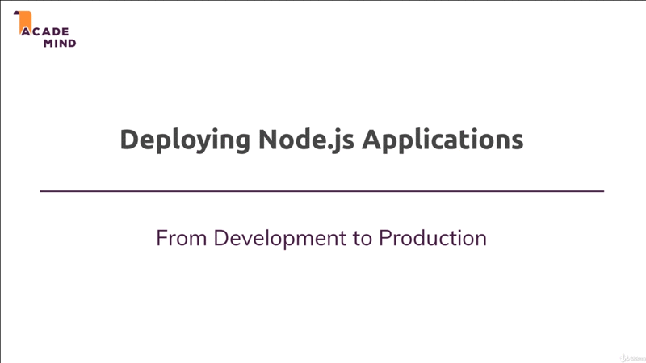
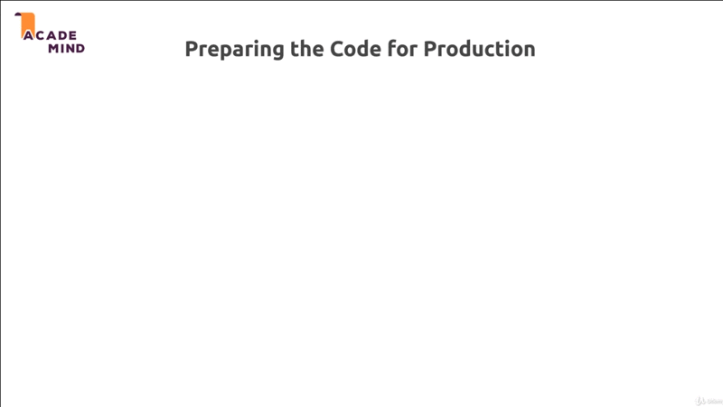

# Deploying App

## Table of Contents

1. [Module Introduction](#module-introduction)
2. [Which Kind of Application](#which-kind-of-application)
3. [Deployment Preparations](#deployment-preparation)

 

## Module Introduction
 

 

**[⬆ back to top](#table-of-contents)**
 
 

## Which Kind of Application
 

 

**[⬆ back to top](#table-of-contents)**
 
 

## Deployment Preparations
 

 

**[⬆ back to top](#table-of-contents)**
 
 
