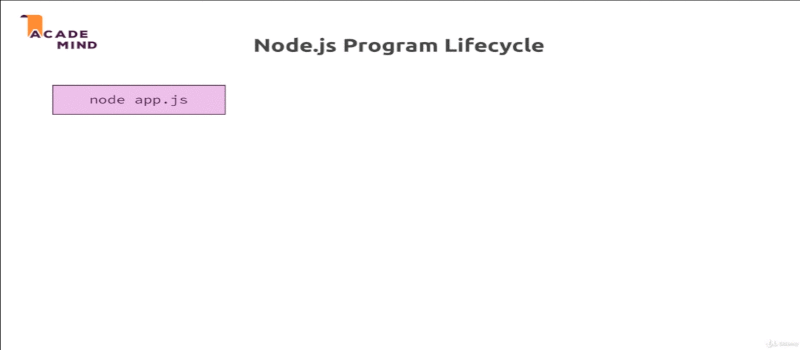
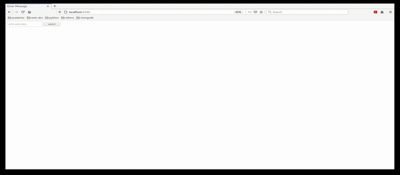
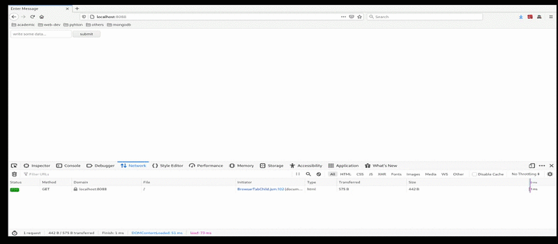

# Chapter-3 Understanding The Basic

## Table of Contents
1. [How The Web Works](#how-the-web-works)
2. [NodeJS Program Lifecycle](#nodejs-program-lifecycle)
3. [Understanding Request](#understanding-request)
4. [Sending Response](#sending-response)
5. [Routing Request](#routing-request)
6. [Redirecting Request](#redirecting-request)
7. [Parsing Request Body](#parsing-request-body)
8. [Understanding Event Driven Code Execution](#understanding-event-driven-code-wexecution)


## How The Web Works
<br/>


<br/>

We get a `user/client` surfing internet, and visiting a webpage and submitting
a **form**. As user interact with webpages `http://my-page.com` what happens
behind the scenes is actually the browser reaches out to some **domain name
server** to lookup that domain up; because the domain is not really the address
of your server, it's basically an encoded human readable version of that
address. Your server itself has just an IP address. In simple word you enter
a url and it will lead to some server.

The browser therefore sends a `request` to server with that given IP address
belonging to that domain.

Here the interest thing happen, you write the `code` that spins up server
which is able to handle the incoming request and do something with it.

Your `code` handling `user input validation`, communicating with the `database`
maybe runs on a separate database server, but which you typically reach out to
from your backend (server side), so your server side code.

Once you're code done with handling request, your `code` send back a `response`
to the webpage (client side); This `response` can be some HTML text. Some HTML
code which is then handled by the client but it could also be some other kind
of data like a file some `json` or `xml` data.

The `response` is more than just the content, a `response` and `request` also
has `headers`.

### What is HTTP, HTTPS

A standardized Protocol to `request` and `response` transmission of
communicating.

A correct handle a `request` and send back a `response` the browser can work
with and there we simply define or it is defined how a valid request looks like
and how the data should be transferred from browser to server and the other way
around.

HTTPS is simply as same with SSL encryption turned on where all the data that is
**transmitted** is actually encrypted so that if anyone is spoofing your
connection, they can't read your data.

### What is headers

Is some meta information which is attached to `request` and `response`
describing what's inside of data that come from your server or API.

### What is event driven

Is programming paradigm in which the flow of the program is determined by events
such as **user action** (mouse clicks, key presses), sensor output, or messages
from other threads.

Event driven is the dominant paradigm used in graphical user interface and ohter
application (e.g, JavaScript web application) that are centered on performing
certain actions in response to user input.

In an `event driven` application, there is generally a **main loop** that
listens for events, and then triggers a callback function when one of those
event detected.

**[⬆ back to top](#table-of-contents)**
<br/>
<br/>

## NodeJS Program Lifecycle
<br/>


<br/>

We execute [main.js](./app.js) and this essentially `started` the script where
NodeJS went through the entire file  `Parse code`, `Registered the variables
functions`.

Then something important happened, we never **left** that program. The reason
for this is an important concept in NodeJS called `event-loop`, this is
basically a loop process which is managed by NodeJS which keeps on running as
there is work to do. It keeps on running as log as there are `event listenrers`
registered and one `event listener` we did register and we never unregistered is
that **incoming** request listener we passed or we setup with the help
create server.

```javascript
"use strict";
const http = require("http");

const server = http.createServer((request, response) => {

    console.log(request);
});
```

We passed the function create server and that basically an ongoing `event
listener`; one we didn't unregister from and we shouldn't because our server
should of course **stay up and running**.

Our code `Node application` basically is managed by this `event loop`, NodeJS
uses such `event driven` approach for all kind of stuff; not just for managing
server, for access a databases, etc.

NodeJS use this pattern because it actually execute **single threaded**
JavaScript. So the entire Node process basically uses one `thread`on our
computer it's running on.

Now as you might guess if we create a server with NodeJS, it should of course be
able to handle multiple, thousand or more of incoming `request`, and if it would
always **pause** and then do something with that `request`, this would not be
that great.

Hence it uses this `event loop` concept where in the end it always keep on
running and just executes when a certain event occurs. So that in general it's
always available.

Whilst this might still sound like OK, but if there's more then one event
incoming request, it needs to handle two events, well it is super fast in
handling these requests and actually behind the scenes, it does some
`multi-threading` by leveraging the OS.

But this `event loop` is a core thing you have to keep in mind; that NodeJS
basically has an `ongoing loop` as long as there are `listeners` and
`createServer()` create a `listener` which never stops.

```javascript
"use strict";
const http = require("http");

const server = http.createServer((request, response) => {

    console.log(request);
    process.exit();         // added
});

sever.listen(8088);
```

If you eventually were to unregister, you can do this by `process.exit()` it would
end all process. The server is still running and `createServer()` function never executed
cause had no **incoming** request yet.  But if we reload `localhost:8088` it's
still log the `request` but then our `server` has quit the `createServer()`
function. Typically you don't call `process.exit()` because you don't want to quit
your server, if it quit people will not be able to reach your webpage anymore.
But this is important for understanding; `process.exit()` basically **hard
exited** `event loop` and therefore the program shut down because there was no
more work to do, NodeJS saw that there's no more work to do, an basically close
the program and gave control back to terminal.

**[⬆ back to top](#table-of-contents)**
<br/>
<br/>

## Understanding Request

There's quite interesting on `request` object, but
there are only a few important fields as developer typically need. The first
important or interesting field is the `request.url`, `request.method`
`request.headers`

```javascript
"use strict";
const http = require("http");


const server = http.createServer((request, response) => {

    console.log("=======================================================");
    console.log("URL:", request.url);
    console.log("=======================================================");
    console.log("METHOD:", request.method);
    console.log("=======================================================");
    console.log("HEADERS:", request.headers)
    process.exit();
});

server.listen(8088);


=======================================================
URL: /
=======================================================
METHOD: GET
=======================================================
HEADERS: {
  host: 'localhost:8088',
  'user-agent': 'Mozilla/5.0 (X11; Linux x86_64; rv:78.0) Gecko/20100101 Firefox/78.0',
  accept: 'text/html,application/xhtml+xml,application/xml;q=0.9,image/webp,*/*;q=0.8',
  'accept-language': 'en-US,en;q=0.5',
  'accept-encoding': 'gzip, deflate',
  connection: 'keep-alive',
  cookie: 'io=qgIo3ExwAF8lrxvmAAAA',
  'upgrade-insecure-requests': '1'
}
```

**[⬆ back to top](#table-of-contents)**
<br/>
<br/>

## Sending Response

```javascript
"use strict"
const http = require("http");


const server = http.createServer((request, response) => {

   response.setHeader("Content-Type", "text/html");
   response.write(`
       <html lang="en">
           <head>
               <title>My firts Page</title>
           </head>
           <body>
               <h1>Hello from Node.JS server!</h1>
           </body>
       </html>
       `);

   response.end();

   console.log("=================================");
   console.log("RESPONSE HEADERS:", response._header);
   console.log("=================================");
   console.log("REQUEST HEADERS:", request.headers);
   console.log("=================================");

});

server.listen(8088);


=================================
RESPONSE HEADERS: HTTP/1.1 200 OK
Content-Type: text/html
Date: Fri, 31 Jul 2020 13:22:16 GMT
Connection: keep-alive
Transfer-Encoding: chunked

=================================
REQUEST HEADERS: {
  host: 'localhost:8088',
  'user-agent': 'Mozilla/5.0 (X11; Linux x86_64; rv:78.0) Gecko/20100101 Firefox/78.0',
  accept: 'text/html,application/xhtml+xml,application/xml;q=0.9,image/webp,*/*;q=0.8',
  'accept-language': 'en-US,en;q=0.5',
  'accept-encoding': 'gzip, deflate',
  connection: 'keep-alive',
  cookie: 'io=qgIo3ExwAF8lrxvmAAAA',
  'upgrade-insecure-requests': '1',
  'cache-control': 'max-age=0'
}
=================================
```

**[⬆ back to top](#table-of-contents)**
<br />
<br />

## Routing Request
<br />



```javascript
"use strict";
const http = require("http");


const server = http.createServer((request, response) => {

    const url = request.url;

    if (url === "/") {
        response.setHeader("Content-Type", "text/html");
        response.write(`
            <html lang="en">
                <head>
                    <title>Enter Message</title>
                </head>
                <body>
                    <form action="/message" method="POST">
                        <input type="text" name="message" placeholder="write some data...">
                        <button type="submit">submit</button>
                    </form>
                </body>
            </html>
        `);
        return response.end(); // It set cause we should not call any response.write() or response.setHeader() after.
    };

    response.setHeader("Content-Type", "text/html");
    response.write(`
       <html lang="en">
           <head>
               <title>My firts Page</title>
           </head>
           <body>
               <h1>Hello from Node.JS server!</h1>
           </body>
       </html>
   `);

    response.end();
});

server.listen(8088);
```

**[⬆ back to top](#table-of-contents)**
<br />
<br />

## Redirecting Request
<br />



```javascript
"use strict";

const http = require("http");
const fs   = require("fs");


const server = http.createServer((request, response) => {

    const url = request.url;
    const method = request.method;

    if (url === "/") {
        response.setHeader("Content-Type", "text/html")
        response.write(`
            <html lang="en">
                <head>
                    <title>Enter Message</title>
                </head>
                <body>
                    <form action="/message" method="POST">
                        <input type="text" name="message" placeholder="write some data...">
                        <button type="submit">submit</button>
                    </form>
                </body>
            </html>
        `);
        return response.end(); // It set cause we should not call any response.write() or response.setHeader() after.
    };

    if (url === "/message" && method === "POST") {

        fs.writeFileSync("message.txt", "DUMMY");
        response.statusCode = 302; // Redirection
        response.setHeader("location", "/");

        return response.end()


    };

    response.setHeader("Content-Type", "text/html");
    response.write(`
       <html lang="en">
           <head>
               <title>My firts Page</title>
           </head>
           <body>
               <h1>Hello from Node.JS server!</h1>
           </body>
       </html>
   `);

    response.end();
});

server.listen(8088);
```

**[⬆ back to top](#table-of-contents)**
<br />
<br />

## Parsing Request Body
<br />


So time to parse the **incoming request**  and get the data that is part of the
`request` because that data should be whatever we entered in `localhost://8088`.
Now how we get access to that ?; we get `request.url` and `request.method` you
might there is something `request.data` ? But there isn't.

Instead the incoming data is basically sent as a `stream` of data and that is
**special construct** JavaScript in general knows and NodeJS uses a lot.

### What is such a stream of data though ?

There is a connected concept `buffer`. We have **incoming request**; `stream` is
basically an ongoing process; the `request` is simply read by Node in chunks
(portion) or in simple word Node read in multiple parts; and in the end at some
point it's done.

We can working on the individual chunks without having to **wait** for the full
`request` being read.

Consider like a file being **uploaded**, this will take considerably longer and
therefore `streaming` that data make sense because it could allow developer to
start writing this your disk, on your hard drive where your Node apps runs on
server while the data is coming in.

You don't have to parse the entire file which is of course taking amount of time
to wait for it to being fully uploaded before you can do anything with it.

This is how NodeJS handles all `request` because it doesn't know in advance how
complex and big the data was in `stream`.

You can **start working on the Data earlier**; the problem is with `your code`,
you can't arbitrarily try to work with these chunks. Instead to organized to
organized this incoming chunks, you use a so-called `buffer`.

A `buffer` is like a buss stop; if you consider buses, they're always driving,
but for users or customers being able to work with bus, customer or user try to
climb on the bus and leave the bus in **bus stops** where you can track the bus
basically and that is what a `buffer` is.

### What is buffer ?

Is simply a **construct** which allow you to hold multiple `chunks` and works
with them before they are released once you're done and you work with that
`buffer`.

Lets take a look the code

```javascript
"use strict";

const http = require("http");
const fs   = require("fs");


const server = http.createServer((request, response) => {

    const url = request.url;
    const method = request.method;

    if (url === "/") {
        response.setHeader("Content-Type", "text/html")
        response.write(`
            <html lang="en">
                <head>
                    <title>Enter Message</title>
                </head>
                <body>
                    <form action="/message" method="POST">
                        <input type="text" name="message" placeholder="write some data...">
                        <button type="submit">submit</button>
                    </form>
                </body>
            </html>
        `);

        return response.end(); // It set cause we should not call any response.write() or response.setHeader() after.
    };

    if (url === "/message" && method === "POST") {

        const body = [];
        request.on("data", (chunk) => {                                 // We instantiate chunk in stream

            console.log("======================");
            console.log("chunk from request.on('data'):", chunk);
            console.log("======================");
            body.push(chunk);                                           // Put chunk into an array
        });

        request.on("end", () => {

            const parsedBody = Buffer.concat(body).toString();
            console.log("parsed chunk:", parsedBody)
            console.log("======================");

            const message = parsedBody.split("=")[1];
            console.log("parsedBody.split:", message)
            console.log("======================");

            fs.writeFileSync("message.txt", message);
        });

        response.statusCode = 302; // Redirection
        response.setHeader("location", "/");

        return response.end();
    };

    response.setHeader("Content-Type", "text/html");
    response.write(`
       <html lang="en">
           <head>
               <title>My firts Page</title>
           </head>
           <body>
               <h1>Hello from Node.JS server!</h1>
           </body>
       </html>
   `);

    response.end();
});

server.listen(8088);

======================
chunk from request.on('data'): <Buffer 6d 65 73 73 61 67 65 3d 68 65 6c 6c 6f>
======================
parsed chunk: message=hello
======================
parsedBody.split: hello
======================
```

**[⬆ back to top](#table-of-contents)**
<br />
<br />


## Understanding Event Driven Code Execution

It a crucial concept that you can register code function which run sometime in
the future but not necessarily run right now.

Let see the pieces of code

```javascript
const server = http.createServer((request, response) => {

    ...
    ...

    if (url === "/message" && method === "POST") {

        const body = [];
        request.on("data", (chunk) => {                                 // We instantiate chunk in stream

            console.log("======================");
            console.log("chunk from request.on('data'):", chunk);
            console.log("======================");
            body.push(chunk);                                           // Put chunk into an array
        });

        request.on("end", () => {

            const parsedBody = Buffer.concat(body).toString();
            const message = parsedBody.split("=")[1];

            fs.writeFileSync("message.txt", message);

            response.statusCode = 302;                                  // Redirection
            response.setHeader("location", "/");

            // The response will not end                                // [2]
            return response.end();
        });

        // Fails to run cause not return anythings                      // [3]
        // Only register the event; not execute any of the events.
        ...
    };

    // XXX This code executed 1st XXX                                   // [1]
    response.setHeader("Content-Type", "text/html");
    response.write(`
       <html lang="en">
           <head>
               <title>My firts Page</title>
           </head>
           <body>
               <h1>Hello from Node.JS server!</h1>
           </body>
       </html>
   `);
}

server.listen(8088)
```

`[1]` The code will run before `[2]`; simply cause `[2]` just a **callback** to
be called sometime in the future.

This setup is important because otherwise NodeJS would have to **pause** until
it's done, **pause** until  it run `fs.writeFileSync()`; if it does that it will
simply **slow** the server performance and server not able to handle `incoming
request` or do anything of that kind until it's done. That what is not developer
want. Developer should never write a code that will result **block code
execution.**.

Developer always want to be in the state to wait for new `event loop`; and then
only execute code once it's to be executed; and never block that `event loop`
for too long of period time.

To resolve this, just simply to return an `event`,

```javascript
const server = http.createServer((request, response) => {

    ...
    ...

    if (url === "/message" && method === "POST") {

        ....
        ....
        return request.on("end", () => {            // return keyword

            ....
            ....
        });
    };

    ....
    ....
}

server.listen(8088)
```

**[⬆ back to top](#table-of-contents)**
<br />
<br />
