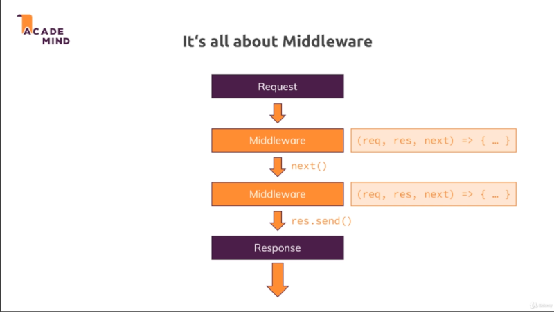

# Chapter-4 Working With ExpressJS

## Table of Contents
1. [Adding Middleware](#adding-middleware)
2. [Parsing Incoming Request](#parsing-incoming-request)
3. [Limiting Middleware to Post Request](#limiting-middleware-to-post-request)
4. [Using Express Routing](#using-express-routing)
5. [Module Summary]($module-summary)

## Adding Middleware
<br />



ExpressJS is all about `middleware` as diagram above. Instead of just having one
`request` handler, you will have a possibility of hooking (connect) in multiple
functions which the `request` will go through until you send a `response`.

`middleware` allows developer to split the code into multiple blocks or pieces;
instead of having one huge function that does everything.

`middleware` is pluggable nature of express, where developer can easily add
other third party packages; which simply happen to give developer such
`middleware` functions that can plug into ExpressJS and add certain
functionalities.

This is a **core** concept of ExpressJS.

### What is Middleware

Is mean that an incoming `request` is automatically funneled (distributed)
through a bunch of functions.

**[⬆ back to top](#table-of-contents)**
<br/>
<br/>

## Parsing Incoming Request

NOTE: middleware always **read** code from **top** to **bottom**

```javascript
"use strict";

// Core Dependencies
//...

// 3rd party Dependencies
const express = require("express");
const bodyParser = require("body-parser");

// Internal Dependencies
//...

const app = express();

// Parser middleware
app.use(bodyParser.urlencoded({ extended: false }));

app.use("/add-product", (request, response, next) => {

    console.log("In '/add-product' middleware!");
    return response.send(`
        <html lang="en">
            <body>
                <h1>The Add-Product page</h1>

                <form action="/product" method="POST">
                    <input type="text" name="title" />
                    <button type="submit">Add Product</button>
                </form>
            </bodym
        </html>
    `);
});

app.use("/product", (request, response, next) => {

    console.log("in '/product' middleware!");
    console.log(request.body);
    return response.redirect("/");
});

app.use("/", (request, response, next) => {

    console.log("In '/' middleware!");
    return response.send('<h1>Hello from Express!</h1>');
});

app.listen(8088);

// localhost:8080/add-product
// Result from server
In '/add-product' middleware!
in '/product' middleware!
[Object: null prototype] { title: 'charger'  }
In '/' middleware!
```

**[⬆ back to top](#table-of-contents)**
<br/>
<br/>

## Limiting Middleware to Post Request

After able to parse incoming `request` body with help of `body-parser` package,
the middleware we use `app.use()` in this code below:

```javascript
app.use("/product", (request, response, next) => {

    console.log("in '/product' middleware!");
    console.log(request.body);
    return response.redirect("/");
});
```

Is always executes, not just for `POST` request only; but also for `GET`
request. What can we do regarding this?  Well instead of use `app.use()` we can
also use `app.get()`;

`app.get()` it basically same as `app.use()` but only will **fire** for
**incoming** `GET` request.

```javascript
app.get("/product", (request, response, next) => {
//  ---
    console.log("in '/product' middleware!");
    console.log(request.body);
    return response.redirect("/");
});
```
`app.get()` besides filtering for the `localhost:8088/product` path; it's allow
developer to filter `GET`request.
<br />
<br />

While on the same page, we also got `app.post()` to filter incoming `POST`
request.

```javascript
app.post("/product", (request, response, next) => {
//  ---
    console.log("in '/product' middleware!");
    console.log(request.body);
    return response.redirect("/");
});
```
`app.post()` is a middleware that only triggered just for incoming `POST` request
with in `localhost:8088/product` path. Not trigger for `GET` request.


**[⬆ back to top](#table-of-contents)**
<br/>
<br/>

## Using Express Routing

Commonly in convention; developer use to `export` the **logic** of code in
different files and `import` it when in needed to use. ExpressJS give developer
a pretty nice way of **outsourcing** `routing` into other files.

Therefore you make in root folder a new folder named as `./routes/`; It's
a convention that developer put `routing` related code into separate folder, so
your code that should execute for different `path` and `http methods`.

### What is express.Router()

Is like a mini Express app tied to other Express app or pluggable into the other
Express app.

**[⬆ back to top](#table-of-contents)**
<br/>
<br/>

## Module Summary
<br/>


After this chapter you know how powerful ExpressJS is, but doesn't mean you
depend on framework.

You still use NodeJS, example we use NodeJS core module `path`; but you build up
on it and get bunch utility functions and a clear set of `rules` on how
developer should structure the app.

ExpressJS it's all about `middleware`; understanding flow of `request` through
all the `middleware` functions is really helpful . You can visit in
[ExpressJS-Middleware](http://expressjs.com/en/guide/using-middleware.html) by
how to using it with appropriate rules; if not your code will end up in
disaster **middleware rabbit hole**.

ExpressJS is popular because it's highly extensible; as you already saw with the
`body-parser`; you can easily plug some packages into an ExpressJS app, because
they just expose such `middleware` functions and as developer  you can therefore
easily add the `middleware-packages` and the request gets **funneled** through
`middleware`.

`middleware functions` are these functions that took `reqeust-object`,
`response-object` that help developer with **sending** a `response`; and that
`next()` argument which turns out to be a function should call to **forward**
a `reqeust` to the **next** `middleware`**in line**; and **in line** means from
**top** to **bottom** in your root file (`app.js`).

This is a crucial point to understand, that as developer should **always** call
`next()`unless you are sending a `response`; in which case you should **never**
call `next()` and that you can therefore cleverly structure your `middleware` to
transform a `reqeust`; read something from it, and send different `response`
depending the `route` you're accessing; depending on the `path`; depending on
`method` you're sending.

You learn that you can **filter** `request` by `path` and `method` easily with
`app.use()` by adding a `path` (`app.use("/admin")`); or by use `app.get()`,
`app.post()`; and if you **filter** by `method`, like you had `app.get()`; that
`paths` would then be matched exactly otherwise with `app.use()`, the `path` you
passed would only be matched with the beginning of the `url`, the part after
`localhost:8080/..`.

You also can use the ExpressJS `router` package instead of `app.use()`,
`app.get()` because this allow you to elegantly split your `routes` across
multiple files since the `router` you `export` there can be added as
a `middleware` function into app.use() in your root file.

Last but not least, we also server some file; It's important to know that you're
**not limited** to serving dummy text or anything like that; You can send files
for examples like `.html`; and if a `request` directly made for a file like
    a `.css` or `.js`

Last but not least, we also serve some file; It's important to know that you're
**not limited** to serving dummy text or anything like that; You can send files
for examples like `.html`; and if a `request` directly made for a file like a
`.css` or `.js` or `images extensions`; you can enable **static serving** for
such file.

With the help of Express static; which is crucial part of any web application
you're building; because developer typically have such files that are
dependencies of your `.html` files for example.

This all **CORE BASIC KNOWLEDGE** you should have about ExpressJS. This is what
we will now build up on and this is where we will now dive deeper into; to learn
how to `render` **dynamic** content, how to **access databases**, **enable
authentication**, **manage data on the server** and so much more.


**[⬆ back to top](#table-of-contents)**
<br/>
<br/>
