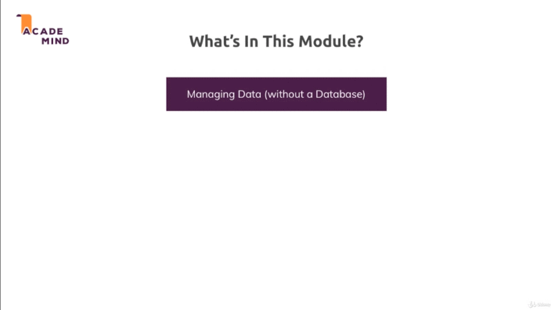

# Chapter-5 Working with Dynamic Content Adding Templating Engines

## Table of Contents
1. [Module Introduction](#module-introduction)

 

## Module Introduction
 

;
 

Developer obviously want to build an application which delivers some value to
users by rendering a HTML pages. In last chapter we working with with static
HTML pages and typically this is not what in real applications doing; just have
**static** HTML code.

Most of the time, instead it is pretty common that Developer dealing with
**data** and **managed** the data on **server**. Later on we will also manage
data in **database**; that you have some data on your server which you want to
dynamically output in the HTML code you send back to users; An example the data
would be a page with a list of **products** where these products of course are
coming from database. So from your server you want to store that data and then
kind of return it; in some other HTML page where developer have that list of
products.

We will have a first look at how can start managing data on a `NodeJS` with
`ExpressJS` as backend environment. No worries there will be a very **extensive
module** about the database so you will learn how to interact with a database
too; But for now let's just `manage data` and let's focus on something on
`render dynamic content`.

So these HTML pages which we're returning should now become more dynamic and
actually contain some content that is dynamically entered into them on the
server; So that if we had additional data on the server, we would send back
a different HTML page with different content.

For this we'll use something called `templating engines`; and you will learn
how such `templating engines` work and use them; there is more than one
alternative and in this modules we present some alternatives `templating engines`.

**[⬆ back to top](#table-of-contents)**
 
 
