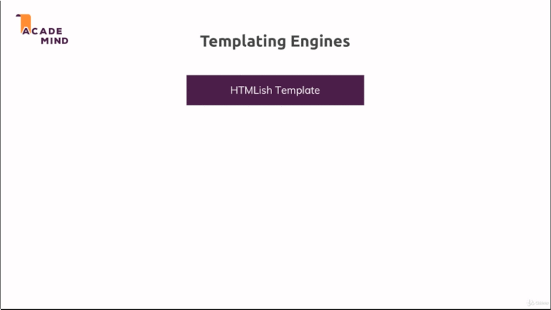
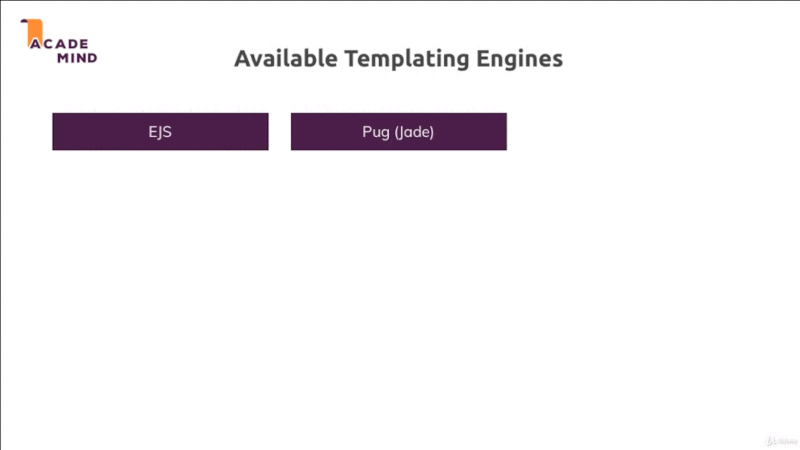

# Chapter-5 Working with Dynamic Content Adding Templating Engines

## Table of Contents
1. [Module Introduction](#module-introduction)
2. [Templating Engines](#templating-engines)

 

## Module Introduction
 

;
 

Developer obviously want to build an application which delivers some value to
users by rendering a HTML pages. In last chapter we working with with static
HTML pages and typically this is not what in real applications doing; just have
**static** HTML code.

Most of the time, instead it is pretty common that Developer dealing with
**data** and **managed** the data on **server**. Later on we will also manage
data in **database**; that you have some data on your server which you want to
dynamically output in the HTML code you send back to users; An example the data
would be a page with a list of **products** where these products of course are
coming from database. So from your server you want to store that data and then
kind of return it; in some other HTML page where developer have that list of
products.

We will have a first look at how can start managing data on a `NodeJS` with
`ExpressJS` as backend environment. No worries there will be a very **extensive
module** about the database so you will learn how to interact with a database
too; But for now let's just `manage data` and let's focus on something on
`render dynamic content`.

So these HTML pages which we're returning should now become more dynamic and
actually contain some content that is dynamically entered into them on the
server; So that if we had additional data on the server, we would send back
a different HTML page with different content.

For this we'll use something called `templating engines`; and you will learn
how such `templating engines` work and use them; there is more than one
alternative and in this modules we present some alternatives `templating engines`.

**[⬆ back to top](#table-of-contents)**
 
 

## Templating Engines
 

;
 

Templating engines works like we got a `html-ish Template` and with HTML
structure and markup into some file; with your style and JavaScript imports. All
3 kind of files `.html`, `.css` and `.js` file typically included but you have
some blanks in there; some placeholder and then you have your `Node/Express
content` in your app, like **product array** (we currently using) and you've got
a templating engine which understand a certain syntax for which it scans your
`html-ish Template` and where it then replaces placeholder or certain snippets
depending on the engine you're using with real HTML content; but this HTML
content it uses there is generated on the fly; on the server by the templating
engine taking that dynamic content into account.

So for example you could output a `<ul>` with `<li>` items for the data you have
in your `Node/Express` app with the help of the templating engine and in the
end; the result will be dynamically; on the fly generated `.html` file which is
then sent back to your users; The users never see the template, all that happens
on the server, they just get a normal `.html` page but it's not hard-coded by
you as it currently is in our project, but instead, it;s generated on the fly.

;
 

We've got a couple of different available templating engines and actually, you
get even more options. We've got `EJS`, `PUG {jade}` and `handlebars`.

These are free templating engines that use a **different syntax** and
**different set of features**, different philosophies that you can use to well
create these template; Inject your dynamic content and get `.html` files out of
them.

`EJS` look something like `
<%= name %>
`; some times you use `=` or
sometimes not use; depend on what you doing, you will see that in this module
and then the dynamic content you want yo output; So if we have some name
variable being injected into our template and you will learn how that injection
works; if we got that then the value of our name variable would be output there
and we would send back an `.html` file with a paragraph tags and the value that
was stored in name between them.

`PUG` uses it doesn't use real HTML, it replaces this with a minimized version
or a minimal version and then it also allows you to output dynamic content with
this syntax `p #name`.

`handlebars` in turns uses `html` again but then you have the `{{}}` placeholder
for the dynamic content, so similar to `EJS`, actually `handlebars` has a bit
less features available; you could say or it follows a different philosophy but
it's closer to `EJS`, `PUG` is the well the **outlier** which also uses
a different `html` syntax.

So a short summary would be `EJS`, normal HTML and then actually you got these
placeholders which allow you to just use plain JavaScript in them actually; So
you can also write `if` statement, `for loops`.

`PUG` use a minimal HTML version and custom template language which is
extensible but generally offers only a set of things, of operations you can do;
but `if` statement and `list`, `iterations` would be included.

`handlebars` uses a normal HTML but also custom template engine with a limited
set of features, including common things like `if` statement or `list`.

**[⬆ back to top](#table-of-contents)**
 
 

