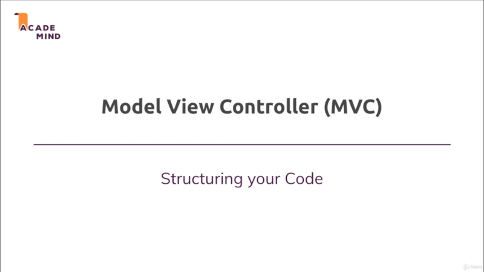
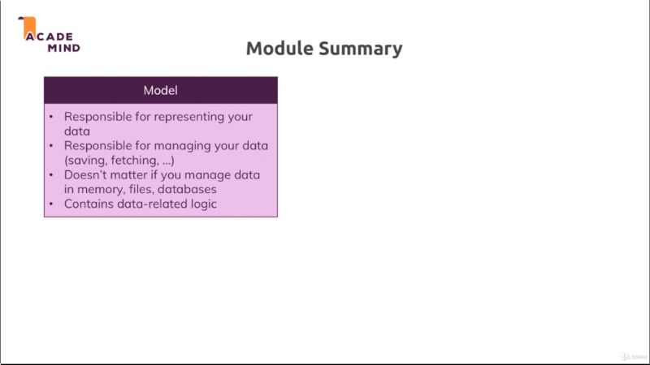

# Chapter-6 The MVC paradigm

## Table of Conuents
1. [Module Introduction](#module-introduction)
2. [Module Summary](#module-summary)

#qq1121112<F3># Module Introduction
 

### So what does `mvc` stand for or what is it ?

It's all about a **separation of concern**. `mvc` making sure that different
part of your code do different things and you clearly know which part is
responsible for what.

MVC stand for `model` `view` `controllers`.

We work with `models`, `views` and `controllers`; actually for example `views`
that is something you already know, we already got views in our `models` are
basically objects or is a part of your code that is responsible for
`representing your data` in your code and allowing you to `work with your data`.
The things like `saving`data, `fetching` data to or from a file or even if it's
just in memory as we're currently doing it this should be handled by `models`.

`views` are responsible for `what the user sees` in the end; `views` are
responsible for rendering the right content in `.html` documents and sending
that back so they are `decoupled from your application code` and are just having
some light or minor integration's regarding the data we inject into our
templating-engine to generate these `views`.

`controllers` are now the **connection point** between the `models` and your
`views` because since the `views` shouldn't care about the **application
logic**; and the `models` **do care** about how to `save` and `fetch` data and
so on.

`controllers` are the thing working with the `models`, saving that data and also
the part where they pass that data that was fetched to your `views` for example.

`controllers` also became **middleman**, it contains the **in-between logic**.
Now in case you're also wondering how `routes` fit into this above gif. Well,
`routes` are basically the things which define upon which _path_ for which
_http_ method, and which `controller` code should execute.

`controller` is then thing defining with which `model` to **work** and which
`view` to **render**.

In an app built with `Express` as we are doing it which heavily relies on this
`middleware`. `controllers` are also kind of **split up** across `middleware`
functions; or some of the logic might be separated and move into another
`middleware` function.

We'll see all that and we'll get there step by for now.

**[⬆ back to top](#table-of-contents)**
 
 

## Module Summary

 

You learned about the **important** `mvc` pattern and there the `model` serves.
The purpose of `representing` amd `managing` data is for `saving` and `fetching`
data; Later also for `updating` data and so on. It doesn't matter if you manage
your data in **memory**, **files** or **database**, it is the model which is
responsible for your data.

`view` on the other hand is responsible for **presenting** a data to the user.
Is responsible for what the user sees and it **shouldn't contain too much
logic** which might remind you of the `handlebars` templating engine. Which kind
of forced you to not put too much logic in there. With `ejs`, the templating
engine you can put more logic into `view` and you should always well **try to
find your own personal balance**; Some people want to have a super pure
approach, other people fine with a little bit of logic in the templates but you
should definitely not put too much logic in `view`.

Your **logic** should be in the `model` or partly in the `controller`, because
the `controller` should do everything that needs to be done to **connect** your
`model` and the `view`.

So to get the data from **A** to **B** or involve in both directions, It can
done through your `view`. Some data was sent to your `NodeJS`-`Express`
application and you need to send data to `model` to **save** or **fetching**
data from the `model`, or via the `model` and send back into `view`.

This is the `mvc` pattern and I will continue to work with that fort the rest of
this project.

**[⬆ back to top](#table-of-contents)**
 
 
