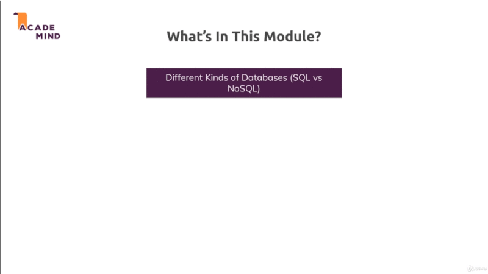
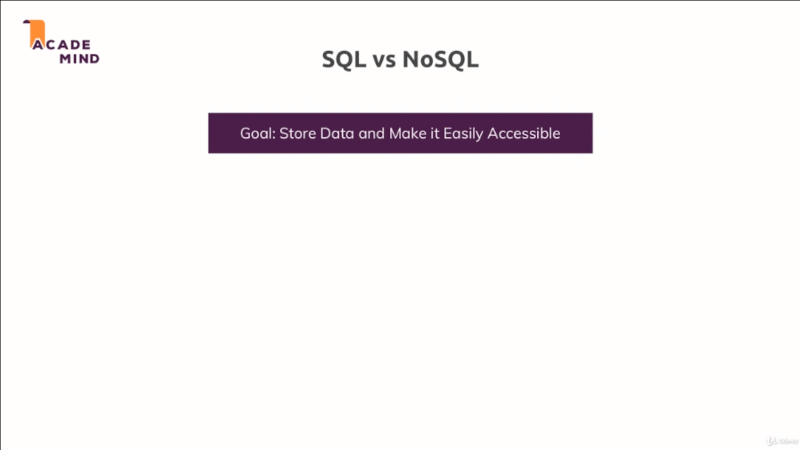
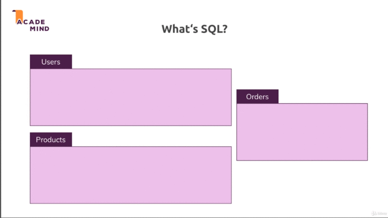
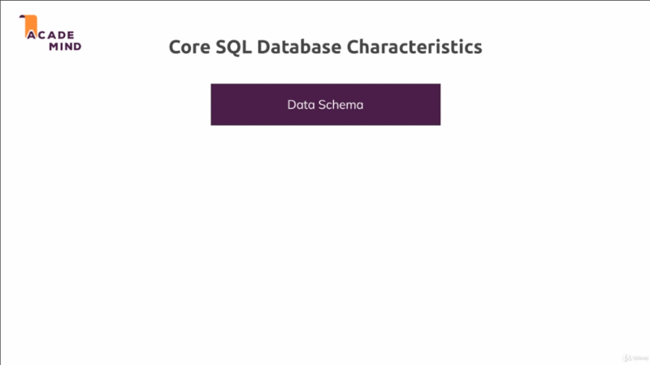
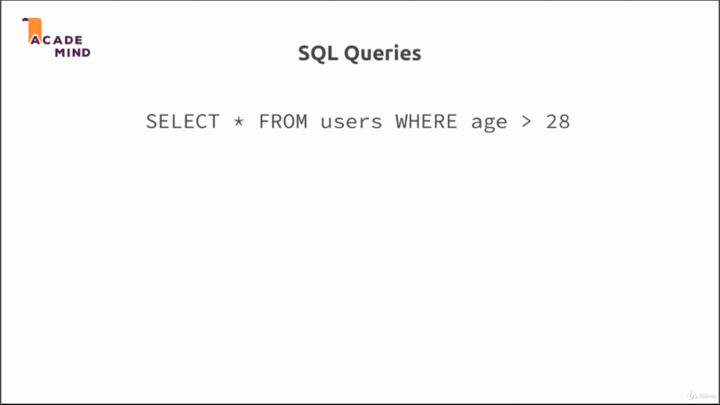
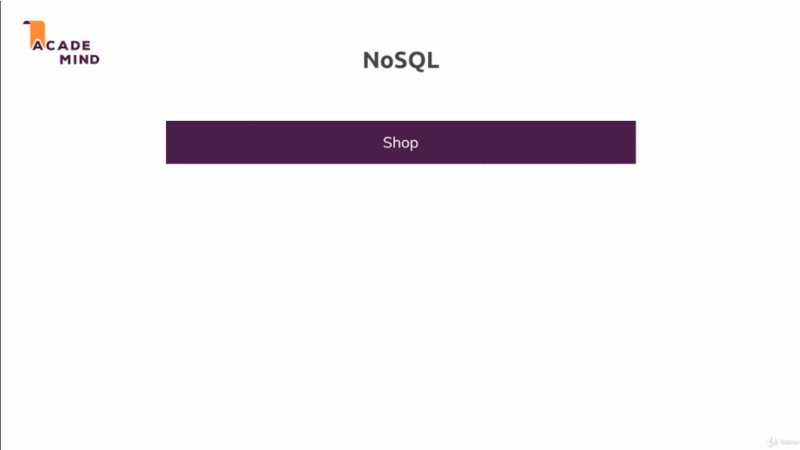
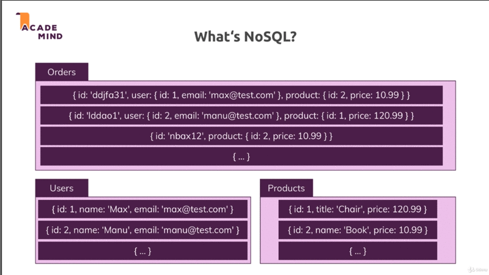
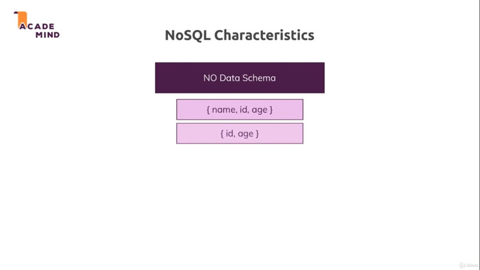
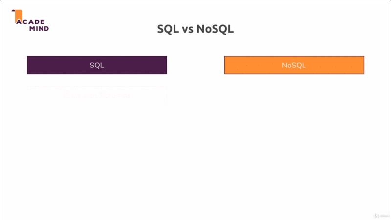

# SQL introduction

## Table of Contents
1. [Module Introduction](#module-introduction)
2. [Choosing Database](#choosing-database)
3. [NoSQL Introduction](#nosql-introduction)
4. [Comparing SQL and NoSQL](#comparing-sql-and-nosql)
5. [Retrieving Data from SQL Database](#retrieving-data-from-sql-database)


## Module Introduction

It's now finally time that we start storing our data in a more correct and
realistic way because thus far, we either used the `memory` when we just stored
the data in a `variable` in our NodeJS program and it was then even shared
across requests or we stored it in a `file` that's also not optimal because
accessing *data from files* is **pretty slow**. Especially as we start storing
more and more data in them. Therefore not really something we would do in a real
application.

Instead there, you typically would use a database which is specific program that
allows you or that is built for storing data and for efficiently retrieving data
too.



Therefore in this module, we'll have a look at the different of two important
different kinds of database, `SQL` and `NoSQL ` databases and compare them,
**highlight** the differences and actually see examples for both.

In this chapter we'll start with `SQL`. `NoSQL` example will also follow in
a separate module but let me first of all show you how you would use a `SQL`
based database together with NodeJS application.

**[⬆ back to top](#table-of-contents)**
<br/>
<br/>


## Choosing Database

So `SQL` or `NoSQL` ?, that is the question and to answer the that question, we
first of all have to understand the difference or what `SQL` and `NoSQL`
database are, how they differ, how differ regarding, how we store the data and so
on.



Our goal always to store data and make it easily available or accessible so that
we have an easy of accessing our data, not just easy from a code prospective
but of course efficiently, it should be fast.

It's simply quicker than accessing a file especially as the data in there grows,
it also helps us with things like we don't have to read the entire file to just
find one piece of information.

Now as I mentioned, we can opt (select) for a `SQL`-based databases; `MySQL`, or
`mariaDB` would be an example database engine that you can use. For `NoSQL`
database there `MongoDB`. `MongoDB` is more prominent (leading) and well known
alternatives.

### What is SQL how does it work then ?
<br/>



`SQL` database thinks in so-called **tables**. We might have a `Users`,
`Products` and `Orders` tables. In each tables you have so called **fields** or
**columns**.

For example, a `User` table could be defined by having an `Id`, `email`, `name`.
`Products` table having an `Id`, `title`, `price` , `description`.

Now we fill in data for these fields, so-called **records**. So basically the
`rows` in our `tables` is record; For example we got a couple users with their
data and we get a couple of products data too.

`SQL` based database also have on important thing, they allow you to **relate**
different `tables`, for example, an `Orders`tables could simply described as
**connection** of a `User` tables and a `Products` tables, because a `User`
might order a couple of different `Products`; and a `Products` might be ordered
by a couple of different `User`

### Core SQL Database Characteristics
<br/>



This is one of the core things about `SQL` in general, the core `SQL` database
characteristics are that we have a strong **Data Schema** so that for each
`table`, we clearly define how the data in there should look like, which **type
of data** does each field store; is it a `number`?, is it a `booelan`?.

So that we have this  strongly or `strict` defined schema; and **all data in the
table has to fit the schema**. This definition of how the data has to look like
is one **core** thing in a `SQL` database.

We also have **relations** between our data, that is another core characteristic
of `SQL` based database.

We relate our different tables with basically three important kind of `relations`:
- one to one
- one to may
- many to many

This simply means that we can have two tables where each records fits one other
record; a record might fit multiple other records or multiple record in table
**A** can fit multiple records in table **B**; and you will see this in practice
and in the code in this module.

### SQL Queries



SQL stand for `Structure Query Language`, `queries` are simply `command` we use
to interact with database. And in `SQL`, a `query` look above. Of course there
are different commands.

Above command wold be that selects all users, so all `entries`, all `records` in the
`Users` table where the age is greater than `28`.

We've hot a couple of keywords there which are making up that `SQL` language, so
the _structured query language_ simply has these keywords, and then we insert some
**parameters** or some data we connect with these keywords.

**[⬆ back to top](#table-of-contents)**
<br/>
<br/>


## NoSQL Introduction

The name `NoSQL` simply means that it doesn't follow the approach `SQL` follows;
It also uses a different query language but instead of having `schemas` and
`relations`. `NoSQL` has other focuses or other strengths.


<br/>

So in `NoSQL` we can still have a database and we can give this database
a _name_ `Shop`. We then have _tables_ `Users`, `Orders` and maybe also
`Products`.

In `NoSQL` tables are _called_ **collection** but you can think of them as
a tables. As the table equivalent but we can call them _collections_ in the
`NoSQL` world.

Now in **collection**, we don't find *records* but so-called **documents** which
look like this:

```sql
{name: 'Max', age: 26}
{name: 'Manu'}
```
Since we're working with JavaScript, kind of see `documents` looks a bit like
JavaScript `object`. `documents` are very close to how we describe data in
JavaScript you could say. Now that are the `documents` in our `collections`; and
what you can already see here in the `Users` `collections` (tables) example is
that `NoSQL` **doesn't have a strict schema**.

We got two `documents` in the same `collection` but the second `document`
_Manu_ does not have an `age` and that is perfectly fine in `NoSQL`.

You can Store multiple **documents** (records) with different structures in the same
**collection** (tables).

Now often you certainly still try to have kind of a similar structure. It's
also **not uncommon** for some applications that you don't always have exactly
same fields available for the data you are storing in the database, and that is
OK in `NoSQL`.

You can definitely store `documents` which are generally equal but where some
fields might differ.

### What is NoSQL
<br/>


<br/>

One other things is that in `NoSQL` world, we got **no real relations**, instead
we go for **duplicate data**. That simply means if we have an `Orders`
`collections` here, we have a **nested** document, the `User` which also is
stored as a separate document with more details maybe in the `Users`
`collection` and we don't connect that through some `ID` or behind the scenes
setup relations, instead we simply duplicate data, to be precise the data we
need in the `Orders` `collection` here.

If all these places need the latest update or the lattes data change but that
can be OK because this on the other hand gives us the huge advantage that if we
ever retrieve data, we don't have to join multiple tables together which can
lead very long and difficult code and which can also impact performance; instead
we can simply read the data from the `Orders` `collection`  and we probably got
all the data we need to display on the order page without having to reach out to
other `collections`.

Therefore this can be done in super fast way and that is one of the huge
advantage of `NoSQL` it can be very fast and efficient.


### NoSQL Characteristics
<br/>


<br/>

`NoSQL` characteristic in general are that we have **no strong** data schema,
**no structure** required, and that we have generally **no data relations**.

We can relate `documents` (records) in some way and this possible and we will
see how to work with connnected data in `NoSQL` module of but generally we have
no or only a few connections and instead try to copy data and have a collection
with documents that work on their own, this is the difference

We also got a difference between `SQL` and `NoSQL`; So as our application grows
and we need to store more, add more data and access that data or work with it
more frequently, we might need to scale our database servers, and we can
differentiate between horizontal and vertical scaling.

**[⬆ back to top](#table-of-contents)**
<br/>
<br/>

## Comparing SQL and NoSQL
<br/>


<br/>

We often need to scale database to keep up with our growing application with
more and more users. Horizontal and vertical scaling are the two approach we can
use to scale database.

In **horizontal** scaling, we simply add more servers; and the advantage here of
course is that we can do this infinitely; We can always buy new servers, be
that on a cloud provider in our own data center and connect them to our database
and split our data across all these servers, of course this means that we also
need some process that runs `quiries` on all of them and merges them together.
This is generally something which is not that easy to do but is of course
a good way of scaling.

In **vertical** scaling is simply means that we make our existing server
stronger by adding more CPU or memory, or with something like that, especially
with cloud providers; this is typically very easy, you simply choose another
option from the dropdown, you pay more and you're done. The problem here is that
you have some limit, you can't fit infinitely much CPU power into a single
machine.

So these diagram below is the steps ways we can scale.


<br/>

In the case of `SQL`:
- Horizontal scaling is very difficult, but vertical scaling is easy
- Limitations of read/write queries per seconds
- use this when you have multiple data, and you want data aggregation to be very
    easy

In the case of `NoSQL`:

- Both horizontal and vertical scaling are easy
- Great performance for mass read/write operations
- Use this when you have to deal with big data

### SQL scale

Regarding that in general. Now in general in `SQL` we use **schemas**, we also
have **relations**. These are two core characteristic and data is typically
`distributed` across many many `tables` which are then connected through
`relations`.

Now regarding the scaling, it's important that **horizontal** scaling often is
very difficult or even impossible due to the way `SQL` works. You can of course
add more servers but running them all on one shared data cloud is pretty
difficult. You can simply make your server stronger but adding more servers can
be very hard or impossible, so definitely not trivial.

This problem possibly if we have multiple or thousand of `read` and `write`
quires **per second**. Then maybe our `SQL` database especially if we do very
complex `joins` between related `tables` can reach limit or can not be the best
choice.

### NoSQL scale

`NoSQL` is **schemaless** and has only a few `relations` if at all, the data is
typically `not distributed` across multiple `collection` (tables) but instead we
work  with `merged` or `nested` documents in an existing `document` (records).

Though we of course also have a couple of `collections` for the different
features of our application typically. With `NoSQL`, horizontal scaling is
easier, still something where your have to know what you do but there are cloud
providers which do that for us; So we don't have to know the **ins** and
**outs** of that and in general, due to the way it works with less connections
and so on, this is possible;

Therefore we also get great performance for mass read and write request and
`NoSQL` can very performant in an application with high throughput.

This makes `SQL` look very bad but the full truth is that its always depends on
the kind of data you are storing. If you are storing where the relations are
really important and where you want to have a split up across `tables` and where
you want to have strong `schemas`, `SQL` an be perfect.

Also not every part of your data is accessed multiple times per second. You can
have parts of your application where you managed general data; let's say user
data which does not change that often and therefore `SQL` might be very good
there.

Other parts of the application, let's say `Orders` or `Shopping` carts that do
change frequently could be stored with `NoSQL` and there, the relations might
also not be that important because you can always put all the information that
belongs to a shopping cart to an order in one single document; and even if you
do for example store some user data there, you might not need to touch that
document (records) just because the user change his photo because you probably
didn't store that along with the order anyways.

In this course, we will build both, and it's not so much about this course
application but you should know how to use `SQL` with NodeJS because maybe you
need to add in your application or you're working on a project where you don't
decide which database to use but you simply have to us it.

**[⬆ back to top](#table-of-contents)**
<br/>
<br/>

## Retrieving Data from SQL Database

I choose to use `MariaDB` as my `SQL` engine. Cause `MariaDB` is open source
base as arch favor development, and not affiliate with others.

Back in the code [app.js](./../project-5/app.js)

```javascript
//...

// @TODO: handle promise
db.execute("SELECT * FROM product")

    .then(result => {
        console.log(result[0]);
    })
    .catch(err => console.log(err));
//...
```

We're executing a `query` here with `execute` on our pool, on the products table
we just created; And added the `then` and `cath` block. These two function we
can chain onto the result of the `execute()` call.

### What is Promise

Promise is a basic JavaScript `object` not specific to NodeJS, it's also
available in JavaScript in the browser which **allows** us to work with `async
code`. Instead of using callback which we could also use with the `MariaDB`
package, `promise` allow us to write more structured code;

Instead of having a **nested anonymous** functions as a second argument,

```javascript
db.execute("SELECT * FROM product", (callback) => {})
```

We simply use `then()` block which will then get the `anonymous` function to
execute.

```javascript
db.execute("SELECT * FROM product")
    .then(result =>{
        console.log(result[0]);
        // do some stuff
    })
    .catch(err => console.log(err));
```


### Why call the result with 'result[0]'

Cause the data retrieved from database in structured as `nested array`

```javascript
[
    [
      BinaryRow {
        id: 1,
        title: 'lettuce',
        price: 20.05,
        imageUrl: 'https://source.unsplash.com/CLwHYy17rSA/800x450',
        description: 'fresh lettuce'
      },
      BinaryRow {
        id: 2,
        title: 'wholemeal bread',
        price: 5.25,
        imageUrl: 'https://source.unsplash.com/qLcSBmaebR8/800x450',
        description: 'fresch wholemeal bread'
      }
    ],
    [
        ColumnDefinition {
          _buf: <Buffer 01 00 00 01 05 35 00 00 02 03 64 65 66 0d 6e 6f 64 65 5f 63 6f 6d 70 6c 65 74 65 07 70 72 6f 64 75 63 74 07 70 72 6f 64 75 63 74 02 69 64 02 69 64 0c ... 493 more bytes>,
          _clientEncoding: 'utf8',
          _catalogLength: 3,
          _catalogStart: 10,
          _schemaLength: 13,
          _schemaStart: 14,
          _tableLength: 7,
          _tableStart: 28,
          _orgTableLength: 7,
          _orgTableStart: 36,
          _orgNameLength: 2,
          _orgNameStart: 47,
          characterSet: 63,
          encoding: 'binary',
          name: 'id',
          columnLength: 11,
          columnType: 3,
          flags: 16899,
          decimals: 0
        },
    ]
]
```

By calling with `result[0]` we just retrieved an `array` not the `nested array`.

### Why failed retrieved single product
<br />

[shop.js](./../project-5/controllers/shop.js)

```javascript
//...

const getProduct = (request, response, next) => {

    const prodId = request.params.productId;

    Product.findById(prodId)
        .then(([product]) => {
            console.log(product)
            response.render('shop/product-detail', {
                pageTitle: product.title,
                path: '/products',
                product: product[0]             // Product get fetched from database
            });
        })
        .catch(err => console.log(err));
};
//..
```

The product get fetched from database still is an array; but the `view` from
[product-detail.ejs](./../project-5/views/shop/product-list.ejs) expects one
single object, not an array with one object. The solution is simply **pass the
first element** in  that array; and we know that there will only be one element
in that array.

**[⬆ back to top](#table-of-contents)**
<br/>
<br/>
